# Try Hack Me - [Buffer Overflows](https://tryhackme.com/room/bof1)
##### Learn how to get started with basic Buffer Overflows!

## Task 1 - Introduction 

In this room, we aim to explore simple stack buffer overflows(without any mitigation's ) on x86-64 linux programs. We will use radare2 (r2) to examine the memory layout. You are expected to be familiar with x86 and r2 for this room. Check the intro to x86-64 room for any pre-requisite knowledge.

We have included a virtual machine with all the resources to ensure you have the correct environment and tools to follow along. To access the machine via SSH, use the following credentials:

##### Username: user1 
##### Password: user1password
```
Connect to our network, deploy the machine and login with the credentials above.
> No answer needed
```

## Task 2 - Process Layout 

When a program runs on a machine, the computer runs the program as a process. Current computer architecture allows multiple processes to be run concurrently(at the same time by a computer). While these processes may appear to run at the same time, the computer actually switches between the processes very quickly and makes it look like they are running at the same time. Switching between processes is called a context switch. Since each process may need different information to run(e.g. The current instruction to execute), the operating system has to keep track of all the information in a process. The memory in the process is organised sequentially and has the following layout:

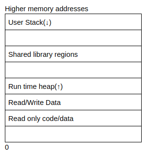

* User stack contains the information required to run the program. This information would include the current program counter, saved registers and more information(we will go into detail in the next section). The section after the user stack is unused memory and it is used in case the stack grows(downwards)
* Shared library regions are used to either statically/dynamically link libraries that are used by the program
* The heap increases and decreases dynamically depending on whether a program dynamically assigns memory. Notice there is a section that is unassigned above the heap which is used in the event that the size of the heap increases.
* The program code and data stores the program executable and initialised variables.
```
Where is dynamically allocated memory stored?
> heap
```

```
Where is information about functions(e.g. local arguments) stored?
> stack
```

## Task 3 - x86-64 Procedures 

A program would usually comprise of multiple functions and there needs to be a way of tracking which function has been called, and which data is passed from one function to another. The stack is a region of contiguous memory addresses and it is used to make it easy to transfer control and data between functions. The top of the stack is at the lowest memory address and the stack grows towards lower memory addresses. The most common operations of the stack are:

**Pushing**: used to add data onto the stack

**Popping**: used to remove data from the stack


<span style="color:red">```push var```</span>

This is the assembly instruction to push a value onto the stack. It does the following:
* Uses var or value stored in memory location of var

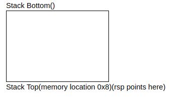

* Decrements the stack pointer(known as ```rsp```) by 8
* Writes above value to new location of ```rsp```, which is now the top of the stack


<span style="color:red">```pop var```</span>

This is an assembly instruction to read a value and pop it off the stack. It does the following:
* Reads the value at the address given by the stack pointer

Stack Bottom()

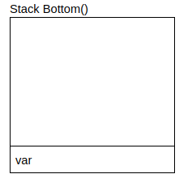

Stack Top(memory location 0x0)(```rsp``` points here)
* Increment the stack pointer by 8
* Store the value that was read from ```rsp``` into var

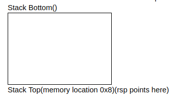

It’s important to note that the memory does not change when popping values of the stack - it is only the value of the stack pointer that changes!

Each compiled program may include multiple functions, where each function would need to store local variables, arguments passed to the function and more. To make this easy to manage, each function has its own separate stack frame, where each new stack frame is allocated when a function is called, and deallocated when the function is complete.

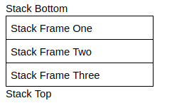

This is easily explained using an example. Look at the two functions:

```c
int add(int a, int b){
int new = a + b;
return new;
}


int calc(int a, int b){
int final = add(a, b);
return final;
}


calc(4, 5)
```

```
what direction does the stack grown(l for lower/h for higher)
> l
```

```
what instruction is used to add data onto the stack?
> push
```

## Task 4 - Procedures Continued 

The explanation assumes that the current point of execution is inside the calc function. In this case calc is known as the caller function and add is known as the callee function. The following presents the assembly code inside the calc function

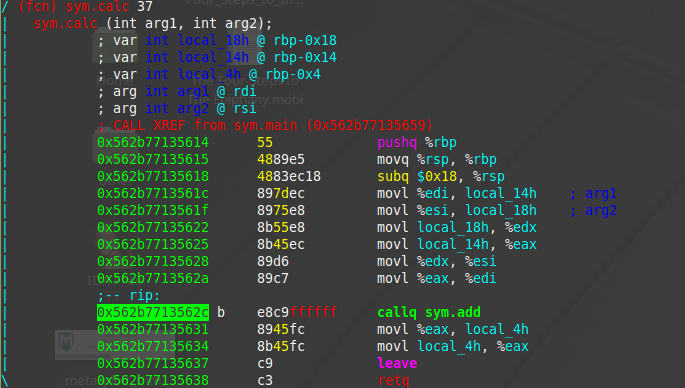

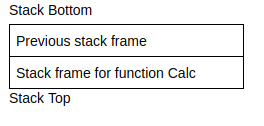

The add function is invoked using the call operand in assembly, in this case callq sym.add. The call operand can either take a label as an argument(e.g. A function name), or it can take a memory address as an offset to the location of the start of the function in the form of call *value. Once the add function is invoked(and after it is completed), the program would need to know what point to continue in the program. To do this, the computer pushes the address of the next instruction onto the stack, in this case the address of the instruction on the line that contains movl %eax, local_4h. After this, the program would allocate a stack frame for the new function, change the current instruction pointer to the first instruction in the function, change the stack pointer(rsp) to the top of the stack, and change the frame pointer(rbp) to point to the start of the new frame.


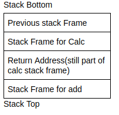

Once the function is finished executing, it will call the return instruction(retq). This instruction will pop the value of the return address of the stack, deallocate the stack frame for the add function, change the instruction pointer to the value of the return address, change the stack pointer(rsp) to the top of the stack and change the frame pointer(rbp) to the stack frame of calc.

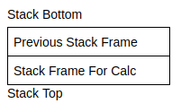

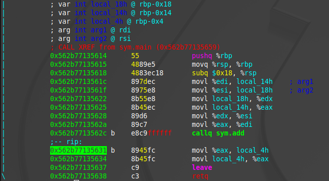

Now that we’ve understood how control is transferred through functions, let’s look at how data is transferred.

In the above example, we save that functions take arguments. The calc function takes 2 arguments(a and b). Upto 6 arguments for functions can be stored in the following registers:

* rdi
* rsi
* rdx
* rcx
* r8
* r9

**Note: rax is a special register that stores the return values of the functions(if any).**

If a function has anymore arguments, these arguments would be stored on the functions stack frame.

We can now see that a caller function may save values in their registers, but what happens if a callee function also wants to save values in the registers? To ensure the values are not overwritten, the callee values first save the values of the registers on their stack frame, use the registers and then load the values back into the registers. The caller function can also save values on the caller function frame to prevent the values from being overwritten. Here are some rules around which registers are caller and callee saved:

* rax is caller saved
* rdi, rsi, rdx, rcx r8 and r9 are called saved(and they are usually arguments for functions)
* r10, r11 are caller saved
* rbx, r12, r13, r14 are callee saved
* rbp is also callee saved(and can be optionally used as a frame pointer)
* rsp is callee saved

So far, this is a more thorough example of the run time stack:

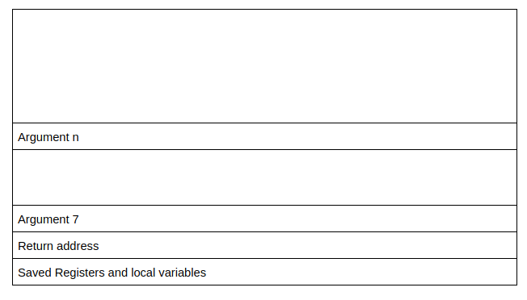

```
What register stores the return address?
> rax
```

## Task 5 - Endianess 

In the above programs, you can see that the binary information is represented in hexadecimal format. Different architectures actually represent the same hexadecimal number in different ways, and this is what is referred to as Endianess. Let’s take the value of 0x12345678 as an example. Here the least significant value is the right most value(78) while the most significant value is the left most value(12).

Little Endian is where the value is arranged from the least significant byte to the most significant byte:


Big Endian is where the value is arranged from the most significant byte to the least significant byte.


Here, each “value” requires at least a byte to represent, as part of a multi-byte object.
```
Read this.
> No answer needed
```

## Task 6 - Overwriting Variables 

Now that we’ve looked at all the background information, let’s explore how the overflows actually work. If you take a look at the overflow-1 folder, you’ll notice some C code with a binary program. Your goal is to change the value of the integer variable.

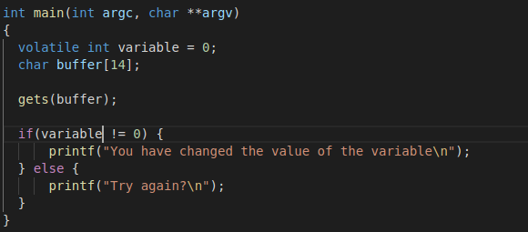

From the C code you can see that the integer variable and character buffer have been allocated next to each other - since memory is allocated in contiguous bytes, you can assume that the integer variable and character buffer are allocated next to each other.

**Note: this may not always be the case. With how the compiler and stack are configured, when variables are allocated, they would need to be aligned to particular size boundaries(e.g. 8 bytes, 16 byte) to make it easier for memory allocation/deallocation. So if a 12 byte array is allocated where the stack is aligned for 16 bytes this is what the memory would look like:**

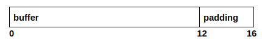

the compiler would automatically add 4 bytes to ensure that the size of the variable aligns with the stack size. From the image of the stack above, we can assume that the stack frame for the main function looks like this:

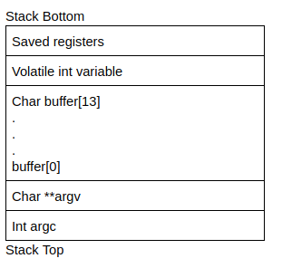

even though the stack grows downwards, when data is copied/written into the buffer, it is copied from lower to higher addresess. Depending on how data is entered into the buffer, it means that it's possible to overwrite the integer variable. From the C code, you can see that the gets function is used to enter data into the buffer from standard input. The gets function is dangerous because it doesn't really have a length check - This would mean that you can enter more than 14 bytes of data, which would then overwrite the integer variable.

Try run the C program in this folder to overwrite the above variable!
```
What is the minimum number of characters needed to overwrite the variable?
> 15
```

## Task 7 - Overwriting Function Pointers 

For this example, look at the overflow- 2 folder. Inside this folder, you’ll notice the following C code.

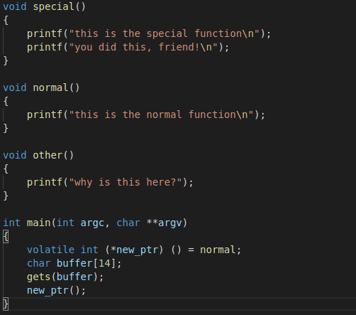

Similar to the example above, data is read into a buffer using the gets function, but the variable above the buffer is not a pointer to a function. A pointer, like its name implies, is used to point to a memory location, and in this case the memory location is that of the normal function. The stack is laid out similar to the example above, but this time you have to find a way of invoking the special function(maybe using the memory address of the function). Try invoke the special function in the program.

Keep in mind that the architecture of this machine is little endian!
```
Invoke the special function()
> No answer needed
```

## Task 8 - Buffer Overflows 

For this example, look at overflow-3 folder. Inside this folder, you’ll find the following C code.

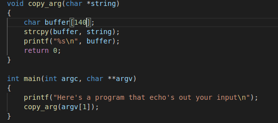

This example will cover some of the more interesting, and useful things you can do with a buffer overflow. In the previous examples, we’ve seen that when a program takes users controlled input, it may not check the length, and thus a malicious user could overwrite values and actually change variables.

In this example, in the copy_arg function we can see that the strcpy function is copying input from a string(which is argv[1] which is a command line argument) to a buffer of length 140 bytes. With the nature of strcpy, it does not check the length of the data being input so here it’s also possible to overflow the buffer - we can do something more malicious here.

Let’s take a look at what the stack will look like for the copy_arg function(this stack excludes the stack frame for the strcpy function):

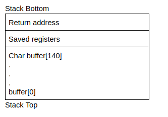

Earlier, we saw that when a function(in this case main) calls another function(in this case copy_args), it needs to add the return address on the stack so the callee function(copy_args) knows where to transfer control to once it has finished executing. From the stack above, we know that data will be copied upwards from buffer[0] to buffer[140]. Since we can overflow the buffer, it also follows that we can overflow the return address with our own value. **We can control where the function returns and change the flow of execution of a program(very cool, right?)**

Know that we know we can control the flow of execution by directing the return address to some memory address, how do we actually do something useful with this. This is where shellcode comes in; shell code quite literally is code that will open up a shell. More specifically, it is binary instructions that can be executed. Since shellcode is just machine code(in the form of binary instructions), you can usually start of by writing a C program to do what you want, compile it into assembly and extract the hex characters(alternatively it would involve writing your own assembly). For now we’ll use this shellcode that opens up a basic shell:

```
\x48\xb9\x2f\x62\x69\x6e\x2f\x73\x68\x11\x48\xc1\xe1\x08\x48\xc1\xe9\x08\x51\x48\x8d\x3c\x24\x48\x31\xd2\xb0\x3b\x0f\x05
```

So why don’t we looking at actually executing this shellcode. The basic idea is that we need to point the overwritten return address to the shellcode, but where do we actually store the shellcode and what actual address do we point it at? Why don’t we store the shellcode in the buffer - because we know the address at the beginning of the buffer, we can just overwrite the return address to point to the start of the buffer. Here’s the general process so far:

* Find out the address of the start of the buffer and the start address of the return address
* Calculate the difference between these addresses so you know how much data to enter to overflow
* Start out by entering the shellcode in the buffer, entering random data between the shellcode and the return address, and the address of the buffer in the return address

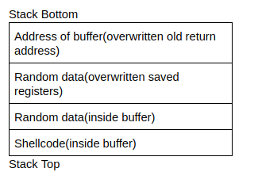

In theory, this looks like it would work quite well. However, memory addresses may not be the same on different systems, even across the same computer when the program is recompiled. So we can make this more flexible using a NOP instruction. A NOP instruction is a no operation instruction - when the system processes this instruction, it does nothing, and carries on execution. A NOP instruction is represented using \x90. Putting NOPs as part of the payload means an attacker can jump anywhere in the memory region that includes a NOP and eventually reach the intended instructions. This is what an injection vector would look like:

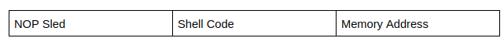

You’ve probably noticed that shellcode, memory addresses and NOP sleds are usually in hex code. To make it easy to pass the payload to an input program, you can use python:

```
python -c “print (NOP * no_of_nops + shellcode + random_data * no_of_random_data + memory address)”
```

Using this format would be something like this for this challenge:

python -c “print(‘\x90’ * 30 + ‘\x48\xb9\x2f\x62\x69\x6e\x2f\x73\x68\x11\x48\xc1\xe1\x08\x48\xc1\xe9\x08\x51\x48\x8d\x3c\x24\x48\x31\xd2\xb0\x3b\x0f\x 05’ +
‘\x41’ * 60 +
‘\xef\xbe\xad\xde’) | ./program_name
”
In some cases you may need to pass xargs before ./program_name.
```
Use the above method to open a shell and read the contents of the secret.txt file.
> omgyoudidthissocool!!
```

## Task 9 - Buffer Overflow 2 

Look at the overflow-4 folder. Try to use your newly learnt buffer overflow techniques for this binary file.
```
Use the same method to read the contents of the secret file!
> wowanothertime!!
```

## Additional Resources